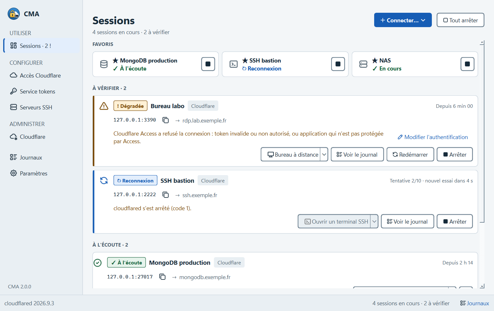
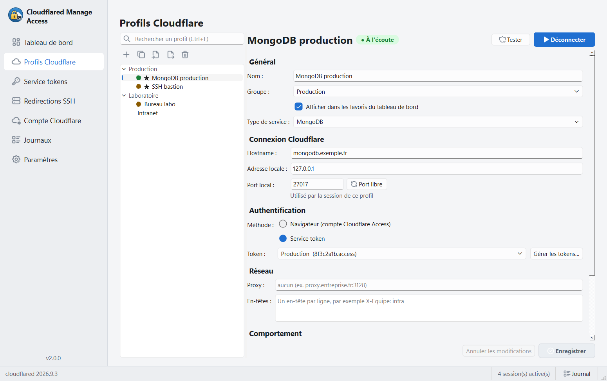
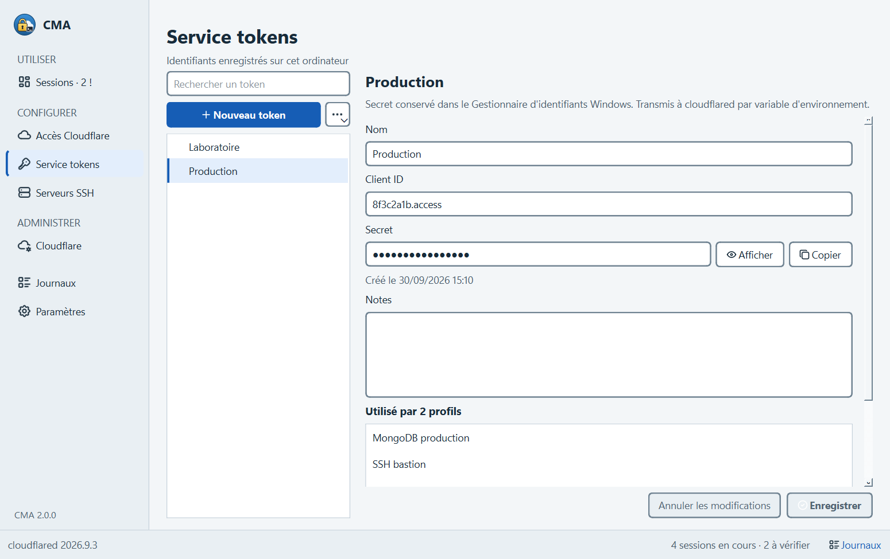
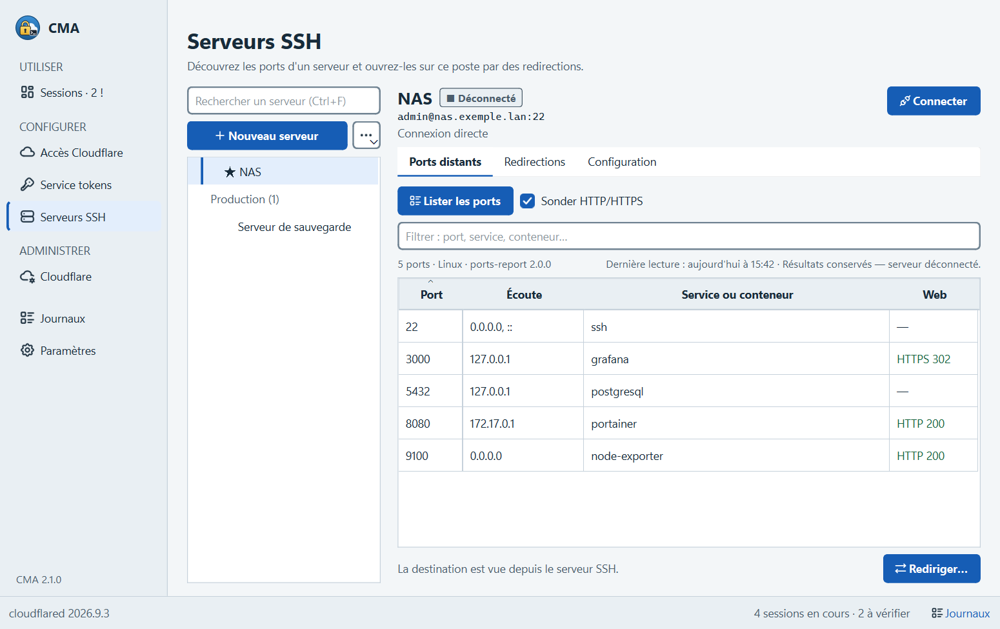
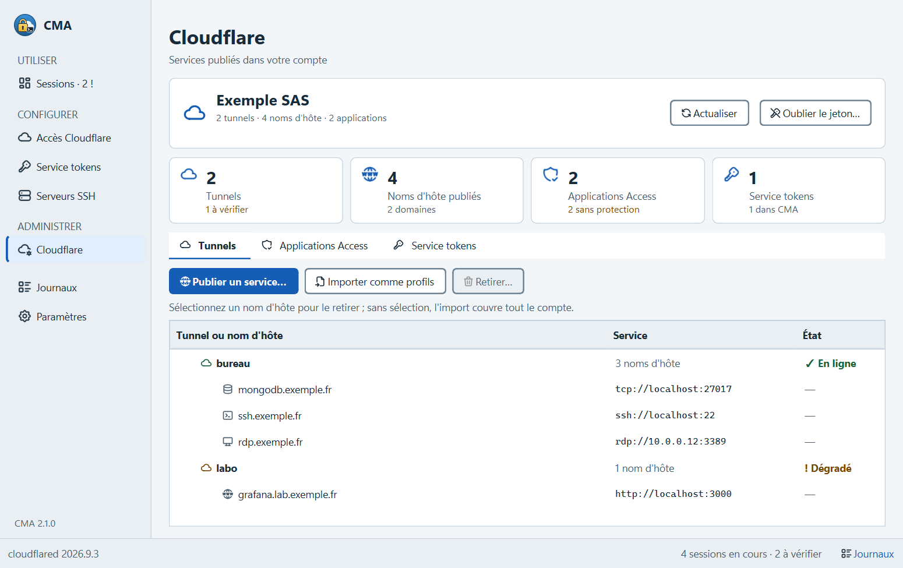
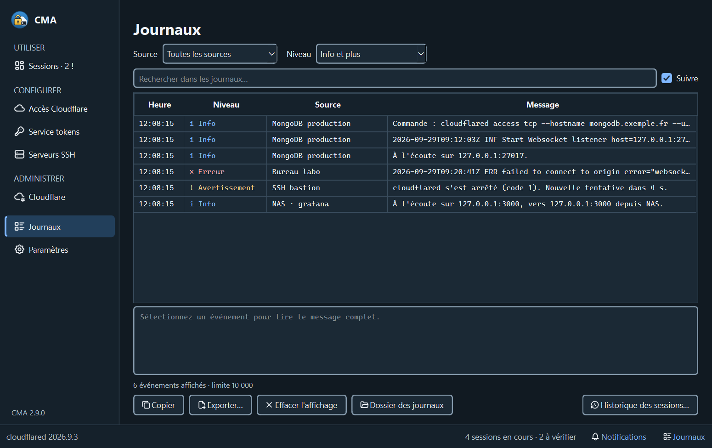

# Cloudflared Manage Access

Application de bureau pour ouvrir, d'un clic, des accès locaux à vos applications protégées par
**Cloudflare Access** (`cloudflared access tcp`) et des **redirections de ports SSH** vers vos serveurs.



Chaque connexion affiche son état réel (à l'écoute, dégradée, en reconnexion, en erreur), se reconnecte
seule si besoin, et vos secrets restent dans le coffre du système, jamais dans un fichier ni sur une ligne de commande.

## Installation

Sous Windows, téléchargez la dernière [release](https://github.com/t3t4rd-3652/Cloudflared-Manage-Access/releases) :

- **`CloudflaredManageAccess-<version>-setup.exe`** : installeur, sans droits administrateur, avec mise à jour en un clic.
- **`CloudflaredManageAccess-<version>-portable.zip`** : version portable, sans installation (voir ci-dessous).

### Version portable

Décompressez le zip où vous voulez, clé USB comprise, puis lancez `CloudflaredManageAccess.exe`. Le dossier `data/`
placé à côté de l'exécutable active le mode portable : configuration, journaux, clés SSH, empreintes des serveurs et
cloudflared téléchargé y restent. Les secrets vont dans un coffre chiffré de ce même dossier, protégé par une phrase
de passe demandée au démarrage : ils suivent le dossier d'un poste à l'autre, sans passer par le Gestionnaire
d'identifiants de Windows. Pour mettre à jour, remplacez les fichiers du programme en gardant `data/`.

Vérifiez le fichier avec `SHA256SUMS.txt` publié à côté :

```powershell
Get-FileHash .\CloudflaredManageAccess-2.0.0-setup.exe -Algorithm SHA256
```

Il faut aussi `cloudflared`. L'application le détecte, ou le télécharge pour vous depuis GitHub en vérifiant son
empreinte SHA-256 et sa signature Cloudflare. Vous pouvez aussi l'installer vous-même :

```powershell
winget install Cloudflare.cloudflared
```

Depuis les sources, sous Windows ou Linux, avec [uv](https://docs.astral.sh/uv/) :

```bash
uv sync
uv run cma            # interface graphique
uv run cma --help     # ligne de commande
```

## Démarrage rapide

1. Au premier lancement, l'assistant vérifie cloudflared et propose de créer un premier profil.
2. Dans **Accès Cloudflare**, créez un profil : nom d'hôte de l'application Access, port local (le bouton « Choisir un port libre » en propose un), méthode d'authentification.
3. Cliquez sur **Connecter**. La page **Sessions** montre la session, son adresse locale et l'action adaptée : navigateur, terminal SSH, Bureau à distance, MongoDB Compass…

Vos données de la v1 (profils, tokens, profils SSH) sont reprises automatiquement au premier lancement de la v2.
Voir [Migration depuis la v1](#migration-depuis-la-v1).

## Fonctions

La navigation suit trois intentions : **Utiliser** (Sessions), **Configurer** (Accès Cloudflare, Service tokens,
Serveurs SSH) et **Administrer** (Cloudflare). Les sessions à vérifier passent en tête, avec la cause et l'action
qui la corrige.

### Accès Cloudflare



- Authentification par navigateur (compte Access) ou par service token. En mode navigateur, **Vérifier le jeton** indique si cloudflared a déjà un jeton Access valide.
- Proxy, en-têtes supplémentaires, groupes, favoris, démarrage et reconnexion automatiques.
- Un groupe se connecte d'un coup : clic droit sur son titre dans la liste, ou menu **Connecter…** de la page Sessions.
- Validation en direct : hostname, port libre ou réservé par Windows (Hyper-V, WSL), proxy.
- Bouton **Tester** : vérifie que Cloudflare Access accepte le token.

### Service tokens



- Le secret est rangé dans le Gestionnaire d'identifiants Windows. Un token est partagé par plusieurs profils sans être recopié.

### Serveurs SSH



- Liste des ports en écoute sur le serveur, avec service, conteneur Docker et statut HTTP, **sans rien installer** sur le serveur. Linux et Windows (OpenSSH Server) sont reconnus automatiquement.
- Redirections enregistrées, démarrées d'un clic, avec compteurs de connexions et d'octets.
- Authentification par mot de passe (mémorisable dans le coffre), par clé (générée ici, avec phrase de passe) ou par agent SSH.
- Vérification de la clé d'hôte au premier contact, avec son empreinte SHA-256.
- Passage par un profil Cloudflare pour les serveurs SSH publiés par Access.

### Administration Cloudflare



Avec un jeton d'API Cloudflare, CMA gère aussi le côté serveur :

- Tunnels du compte et noms d'hôte qu'ils publient. Un clic les transforme en profils CMA, port local et type de service compris.
- **Publier un service** : nom d'hôte vers service du réseau privé, avec l'enregistrement DNS, l'application Access et le service token autorisé.
- Service tokens créés depuis CMA, rangés directement dans le coffre : leur secret n'est jamais affiché.
- Permissions du jeton d'API et détails dans [docs/SECURITE.md](docs/SECURITE.md).

### Au quotidien

- Icône dans la zone de notification, dont la couleur reflète l'état global, avec les favoris dans son menu.
- Notifications au lieu de fenêtres bloquantes, journaux en direct filtrables (thème sombre ci-dessous).
- Thème clair, sombre ou système, style Windows 11, interface nette à toutes les échelles d'affichage.
- Import et export des profils. Les secrets sont exclus par défaut, ou chiffrés par une phrase de passe.
- Démarrage avec Windows, instance unique, rapport de diagnostic sans secrets.
- Mise à jour en un clic de la version installée : installeur téléchargé, vérifié par SHA-256, puis relance.
- Utilisable au clavier et avec un lecteur d'écran (NVDA, Narrateur) : chaque contrôle a un nom.



## Ligne de commande

`cma.exe` (ou `uv run cma`) pilote l'application en cours, ou travaille seul si elle n'est pas lancée :

```text
cma list                     profils Cloudflare et SSH
cma connect "SSH prod"       ouvre la connexion d'un profil (au premier plan si l'application ne tourne pas)
cma connect --group Prod     connecte tous les profils Cloudflare du groupe « Prod »
cma status                   sessions ouvertes par l'application
cma disconnect --group Prod  ferme les connexions du groupe
cma disconnect --all         ferme toutes les connexions
cma quit                     ferme l'application
cma doctor                   crée un rapport de diagnostic (zip, sans secrets)
```

## Côté serveur

Pour lister les ports d'un serveur, l'application y envoie le script [`server/ports-report`](server/ports-report)
par l'entrée standard (`bash -s`). Il suffit de `bash` et `ss`, présents sur toute distribution Linux récente.

Pour afficher le nom des conteneurs Docker à un utilisateur qui n'est pas dans le groupe `docker`, installez le petit
helper en lecture seule :

```bash
sudo ./server/install.sh --user alice
```

Détails, désinstallation et sécurité : [docs/SERVEUR.md](docs/SERVEUR.md).

## Sécurité

- cloudflared est lancé sans shell, avec une liste d'arguments. Le secret du service token passe par une variable d'environnement, jamais par la ligne de commande.
- Les secrets sont dans le coffre du système. La configuration `config.json` n'en contient aucun.
- Les clés d'hôte SSH sont vérifiées. Une clé inconnue ou modifiée demande votre confirmation.
- Les téléchargements de cloudflared sont vérifiés par leur empreinte SHA-256 et leur signature Authenticode.
- Les journaux masquent les secrets.

Détails et modèle de menace : [docs/SECURITE.md](docs/SECURITE.md).

## Où sont mes données ?

| Élément | Emplacement |
| --- | --- |
| Configuration, journaux, clés SSH, sauvegardes | `%APPDATA%\CloudflaredManager` (ou `data\` en mode portable) |
| Secrets (tokens, mots de passe mémorisés) | Gestionnaire d'identifiants Windows, entrées `CloudflaredManageAccess` |
| Empreintes des serveurs SSH | `known_hosts` dans le dossier de données |

## Migration depuis la v1

Au premier lancement, la v2 lit les fichiers de la v1 dans `%APPDATA%\CloudflaredManager`, en garde une copie
(`backup-v1-<date>`), range les secrets dans le coffre et affiche un rapport. Les secrets que la v1 recopiait dans
chaque profil sont regroupés dans des tokens. Rien n'est supprimé sans votre accord : une fois la migration vérifiée,
**Paramètres › Données › Supprimer les fichiers v1** retire les anciens fichiers, qui contiennent vos secrets en clair.

La v1 (Tkinter) n'est plus dans le dépôt depuis la 2.0.0. Son dernier exécutable reste téléchargeable dans la
release [V1.3.9](https://github.com/t3t4rd-3652/Cloudflared-Manage-Access/releases/tag/V1.3.9).

## Développement

```bash
uv sync                                   # environnement complet (Python 3.13 ou plus)
uv run pytest                             # tests (unitaires, intégration, interface)
uv run ruff check src tests && uv run pyright
bash tests/server/run-in-docker.sh        # tests des scripts serveur (Debian, Ubuntu, Alpine)
uv run python packaging/build.py          # distribution Windows dans dist/
```

Architecture : [docs/ARCHITECTURE.md](docs/ARCHITECTURE.md). Contribuer : [CONTRIBUTING.md](CONTRIBUTING.md).
Historique : [CHANGELOG.md](CHANGELOG.md).

## Licence

MIT, voir [LICENSE.md](LICENSE.md). Composants tiers : [THIRD_PARTY_LICENSES.md](THIRD_PARTY_LICENSES.md).
