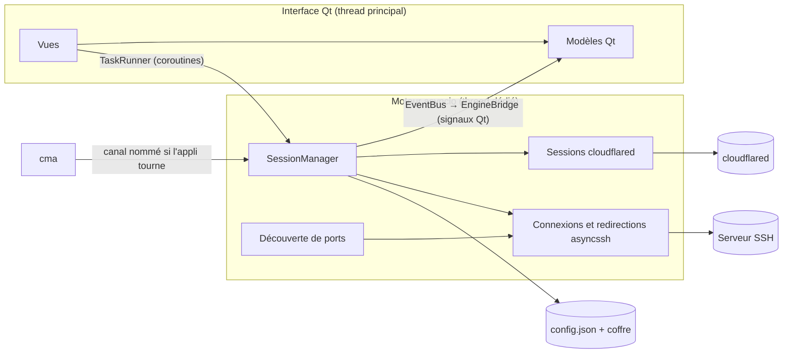
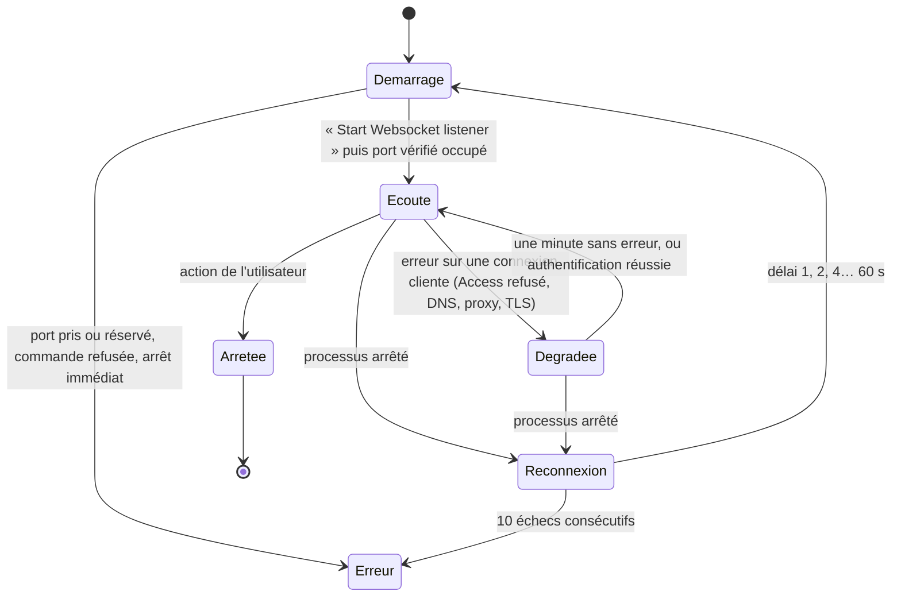

# Architecture

## Vue d'ensemble

Deux règles structurent le code :

- `cma.core` n'importe jamais Qt. Il est testé seul et réutilisé tel quel par la ligne de commande.
- `cma.ui` ne fait aucune entrée-sortie. Il soumet des coroutines au moteur (`GuiContext.run`) et réagit aux événements du bus.

## Arborescence

| Chemin | Rôle |
| --- | --- |
| `src/cma/core/models.py` | Modèles pydantic : profils, tokens, profils SSH, redirections, paramètres. Schéma v2. |
| `src/cma/core/config_store.py` | `config.json` : écriture atomique, sauvegardes, restauration, lecture seule si plus récent. |
| `src/cma/core/migrations.py` | Conversion des 4 fichiers de la v1, secrets vers le coffre, rapport. |
| `src/cma/core/secrets.py` | Coffre : keyring, fichier chiffré, mémoire. |
| `src/cma/core/transfer.py` | Import et export, plan de conflits, secrets chiffrés. |
| `src/cma/core/sessions.py` | Base des sessions : états, journal circulaire, délai de reconnexion. |
| `src/cma/core/cloudflared/` | Commande sans shell, analyse des journaux, session, binaire et téléchargement vérifié. |
| `src/cma/core/ssh/` | Connexions asyncssh (rebond ProxyJump compris), clés d'hôte, clés, redirections locales, inverses et SOCKS 5, découverte de ports (Linux et Windows). |
| `src/cma/core/cfapi.py` | Client de l'API Cloudflare v4 : comptes, zones, tunnels, DNS, Access, service tokens. |
| `src/cma/core/cfadmin.py` | Relie l'API à la configuration et au coffre : import de profils, tokens, publication, tunnels. |
| `src/cma/core/policies.py` | Politiques Access : conversion depuis et vers l'API, saisie une règle par ligne. |
| `src/cma/core/expiry.py` | Échéance des service tokens : dates de l'API, tokens à renouveler. |
| `src/cma/core/tunnelhealth.py` | Diagnostic d'un tunnel d'après ses connecteurs. |
| `src/cma/core/updates.py` | Nouvelles versions de CMA : installeur vérifié, ou mise à jour en place de la version portable. |
| `src/cma/core/probe.py`, `diagnose.py` | « Tester le service » et diagnostic guidé (cloudflared, port, DNS, proxy, HTTPS, Access). |
| `src/cma/core/dpapi.py` | Phrase de passe du coffre portable mémorisée par DPAPI (Windows). |
| `src/cma/core/manager.py` | Orchestrateur : profils vers sessions, actions exposées à l'interface et à la CLI. |
| `src/cma/core/engine.py` | Boucle asyncio dans un thread. |
| `src/cma/core/instance.py` | Verrou d'instance unique et canal de commande local. |
| `src/cma/platform/` | Job Object Windows, démarrage automatique, lanceurs (terminal, RDP, Compass). |
| `src/cma/ui/` | Interface : fenêtre, vues, boîtes de dialogue (palette Ctrl+K, espaces de travail, diagnostic), thème, verrouillage, zone de notification. |
| `src/cma/i18n.py`, `i18n_en.py` | Traduction (source en français, catalogue anglais vérifié par test). |
| `server/` | `ports-report` (Linux), `ports-report.ps1` (Windows) et l'installeur du helper Docker. |
| `src/cma/ui/a11y.py` | Noms accessibles déduits des formulaires, et contrôle automatique en test. |
| `packaging/` | Spec PyInstaller, installeur Inno Setup, build Windows et Linux, signature, manifestes winget et Scoop. |
| `bucket/` | Bucket Scoop, mis à jour par le workflow de release. |

## Cycle de vie d'une session cloudflared

Particularités observées sur cloudflared 2026.7.2, capturées dans les tests de `log_parser` :

- « Start Websocket listener » est écrit **avant** l'ouverture du port. L'écoute est donc confirmée par une tentative de `bind` sur le même port, qui doit échouer, sans jamais s'y connecter (une connexion déclencherait l'authentification Access).
- Une option invalide fait sortir cloudflared avec le code 0 : tout arrêt avant l'écoute est traité comme une erreur.
- Les erreurs d'accès n'arrêtent pas le processus : elles apparaissent à chaque connexion cliente.

## Redirections SSH

Une connexion asyncssh par profil est partagée entre la découverte et les redirections.
Chaque redirection est un serveur asyncio local sur `127.0.0.1`, qui relaie par blocs de 64 Kio vers
`conn.open_connection(hôte, port)`, avec compteurs et demi-fermeture TCP respectée.
Si la connexion SSH tombe, le port local reste ouvert et la session se reconnecte ; le mot de passe est gardé en
mémoire le temps de la session.

Chaînage par Cloudflare : `SshConnectionManager` demande au `SessionManager` d'ouvrir le tunnel du profil Cloudflare
(`_cloudflare_bridge`), attend son écoute, puis se connecte à `127.0.0.1:<port>` avec l'identité de clé d'hôte du vrai serveur.

## Démarrage

asyncssh et cryptography coûtent près de 400 ms à l'import et ne servent pas avant la première connexion SSH
ou le premier export chiffré. Les modules SSH passent donc par un proxy (`cma.core.ssh._lazy`) qui les importe
au premier usage, et l'application les précharge dans un thread 300 ms après l'affichage de la fenêtre.

## Threads

| Thread | Contenu |
| --- | --- |
| Principal | Qt : fenêtres, modèles, boîtes de dialogue |
| `cma-engine` | Boucle asyncio : sessions, SSH, sous-processus, téléchargements (`asyncio.to_thread`) |
| `cma-ipc` | Canal local : reçoit les commandes de `cma` et les exécute dans le moteur |
| `cma-warmup` | Préchargement d'asyncssh après l'affichage de la fenêtre |

Les questions du moteur (mot de passe, clé d'hôte) passent par `GuiPrompter` : un signal Qt ouvre la boîte de dialogue
dans le thread principal, la réponse revient au moteur par `call_soon_threadsafe`.

## Données

Format de `config.json` : voir `Config` dans `models.py`.
Chaque évolution du schéma incrémente `schema_version` et ajoute une migration testée.

## Qualité

| Commande | Rôle |
| --- | --- |
| `uv run pytest` | Tests unitaires, d'intégration (faux cloudflared, serveur SSH asyncssh en mémoire) et d'interface (pytest-qt) |
| `uv run ruff check`, `uv run pyright` | Lint et typage (strict sur `cma.core`) |
| `bash tests/server/run-in-docker.sh` | Scripts serveur sous Debian (mawk), Ubuntu et Alpine (busybox) |
| `uv run python scripts/capture_screenshots.py` | Captures de la documentation, avec données fictives |
| `uv run python scripts/startup_benchmark.py` | Temps d'affichage de la fenêtre (contrôlé par la CI) |
| `uv run python scripts/compare_captures.py` | Écarts entre deux jeux de captures (informatif en CI) |
