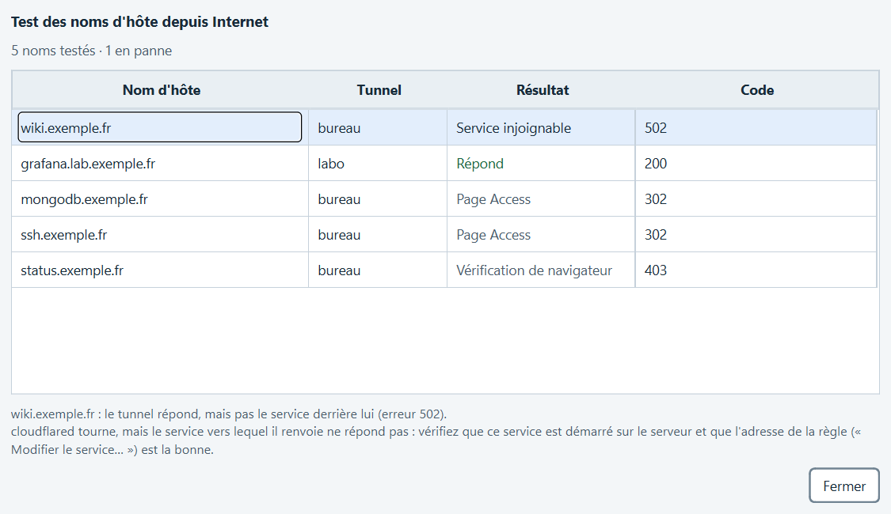
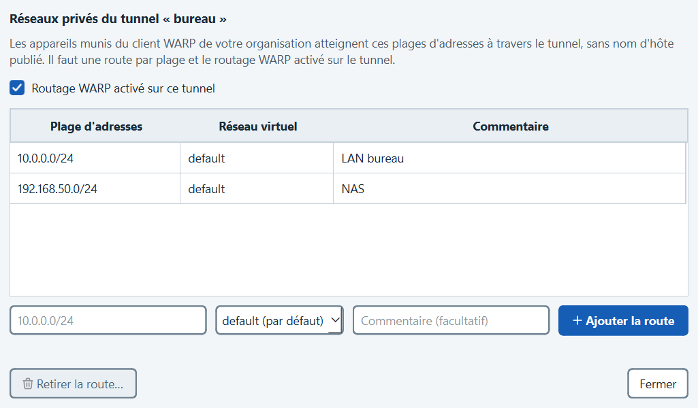
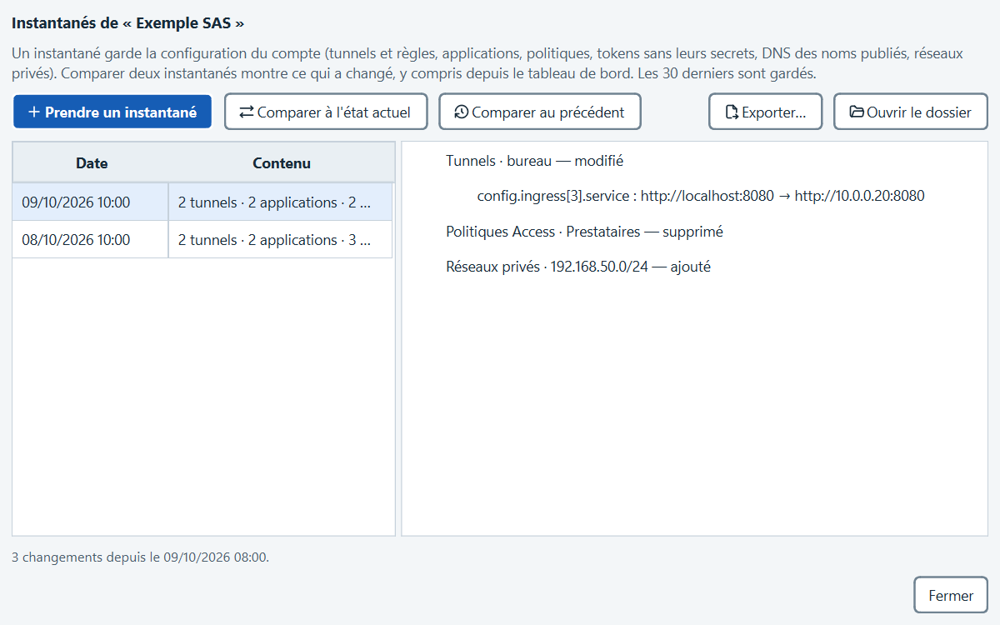
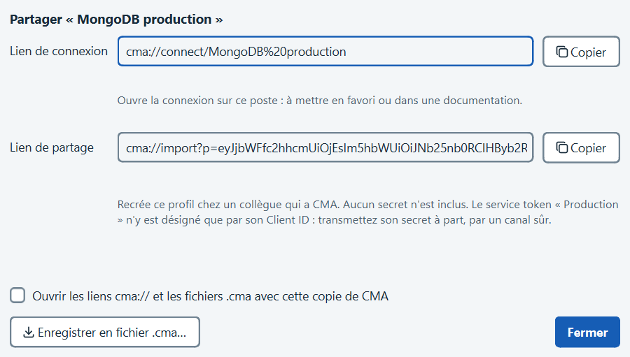

# Guide d'utilisation

Ce guide part de ce que vous voulez faire. Pour la liste des fonctions, voir le [README](../README.md) ; pour la
sécurité et les permissions du jeton d'API, [SECURITE.md](SECURITE.md).

- [Ouvrir un accès Bureau à distance (RDP)](#ouvrir-un-accès-bureau-à-distance-rdp)
- [Publier un nouveau service](#publier-un-nouveau-service)
- [Un service ne répond plus (erreur 502, 1033…)](#un-service-ne-répond-plus-erreur-502-1033)
- [Être prévenu sur son téléphone, suivre la disponibilité](#être-prévenu-sur-son-téléphone-suivre-la-disponibilité)
- [Renouveler un service token](#renouveler-un-service-token)
- [Donner accès à un réseau privé (WARP)](#donner-accès-à-un-réseau-privé-warp)
- [Vérifier la sécurité du compte](#vérifier-la-sécurité-du-compte)
- [Savoir ce qui a changé sur le compte](#savoir-ce-qui-a-changé-sur-le-compte)
- [Partager un accès avec un collègue](#partager-un-accès-avec-un-collègue)
- [Travailler avec plusieurs comptes Cloudflare](#travailler-avec-plusieurs-comptes-cloudflare)

## Ouvrir un accès Bureau à distance (RDP)

Le poste distant est publié par un tunnel Cloudflare (`rdp://…`) et protégé par Cloudflare Access.

1. **Accès Cloudflare › Nouveau profil**. Donnez un nom, puis le **nom d'hôte** publié (par exemple
   `rdp.exemple.fr`). **Choisir un port libre** propose un port local. Choisissez le **type de service** « RDP » :
   c'est lui qui donne l'action Bureau à distance.
2. Onglet **Authentification** : « Navigateur » si vous vous connectez avec votre compte de l'organisation, ou
   « Service token » pour une machine (le token se crée dans **Service tokens**).
3. **Enregistrer**, puis **Connecter**. La page **Sessions** montre la session à l'écoute et l'action
   **Bureau à distance**, qui ouvre le client RDP sur le port local.

Le profil existe déjà dans Cloudflare ? Dans **Cloudflare › Tunnels**, sélectionnez le nom d'hôte puis
**Importer comme profils** : nom, port et type de service sont remplis pour vous.

En cas de souci, **Diagnostiquer…** (menu de la session ou du profil) vérifie cloudflared, le port local, le DNS,
Access et l'authentification, et dit quoi corriger.

## Publier un nouveau service

Il faut un tunnel en ligne (sinon **Créer un tunnel…** donne la commande d'installation de son connecteur) et un
jeton d'API Cloudflare (**Cloudflare**, première visite).

1. **Cloudflare › Tunnels › Publier un service…**
2. **Nom d'hôte · Domaine** : le nom public (par exemple `wiki` sur `exemple.fr`). **Service** : l'adresse vue
   depuis le serveur du connecteur (par exemple `http://localhost:8080` ou `rdp://10.0.0.12:3389`).
3. Gardez **Protéger par Cloudflare Access** cochée, et choisissez le **service token autorisé** si une machine
   doit y accéder. **Créer le profil CMA correspondant** prépare l'accès depuis ce poste.
4. **Publier** : CMA crée la règle du tunnel, l'enregistrement DNS, l'application Access et le profil demandé.
   Chaque étape est rapportée ; une étape en échec n'annule pas les précédentes.

Ensuite, depuis le menu d'un nom d'hôte : **Modifier le service…**, **Ajouter une règle avec chemin…** (`/api`
vers un autre service), **Monter** et **Descendre** pour l'ordre des règles, **Retirer ce nom d'hôte…**.

## Un service ne répond plus (erreur 502, 1033…)

CMA teste toutes les 15 minutes, depuis Internet, chaque nom d'hôte HTTP des tunnels en service (Paramètres ›
Général › Cloudflare). Un nom en panne apparaît en notification, dans « Cloudflare · 1 ! » de la navigation et
sur sa carte.

Pour tester à la demande : clic droit sur un nom d'hôte › **Tester depuis Internet**, ou **Tester tous les noms
d'hôte** pour un tableau récapitulatif, pannes en premier. Le conseil de la ligne choisie s'affiche dessous.

| Résultat | Ce que cela veut dire | Que faire |
| --- | --- | --- |
| **Service injoignable** (502, 504) | Le tunnel répond, pas le service derrière lui. | Vérifier que le service tourne sur le serveur, puis l'adresse de la règle (**Modifier le service…**). |
| **Aucun connecteur** (1033) | Aucun cloudflared n'est relié au tunnel. | Relancer cloudflared sur le serveur ; **État des connecteurs…** dans le menu du tunnel. |
| **Nom introuvable** | Le nom n'existe pas dans le DNS public. | **Corriger le DNS…** dans le menu du nom d'hôte. |
| **Vérification de navigateur** | Un réglage de sécurité de la zone (Bot Fight Mode, « I'm Under Attack », règle WAF) demande un défi. | Rien pour un humain ; pour une machine munie d'un service token, régler l'exception dans le tableau de bord (Sécurité). |
| **Page Access** | Access demande de se connecter : normal sans service token. | Rien. Un service SSH, RDP ou TCP n'est testé que jusque-là ; testez-le avec une session. |
| **Token refusé** (401, 403) | Le service token du profil n'est autorisé par aucune politique. | **Autoriser un service token…** dans l'onglet Applications. |

Avec la permission « Analytics : Read » sur le jeton, chaque carte montre aussi le trafic des dernières 24 heures
et le nombre d'erreurs 5xx renvoyées aux visiteurs.

## Être prévenu sur son téléphone, suivre la disponibilité

**Paramètres › Général › Alertes › Ajouter un canal…** : choisissez le type et collez l'adresse.

| Type | Adresse |
| --- | --- |
| ntfy (application ntfy sur le téléphone) | `https://ntfy.sh/<un sujet difficile à deviner>`, ou votre propre serveur ntfy |
| Slack | webhook entrant de l'application Slack |
| Microsoft Teams | workflow « Publier dans un canal quand une requête webhook est reçue » |
| Discord | webhook du salon (Paramètres du salon › Intégrations) |
| Webhook | toute adresse qui accepte un JSON (`title`, `text`, `level`, `at`) |

**Envoyer un test** vérifie le canal. Les pannes et les retours partent ensuite vers chaque canal actif, depuis CMA
ouvert comme depuis la tâche planifiée (Paramètres › Général › Cloudflare).

Une maintenance prévue ? Clic droit sur le tunnel ou le nom d'hôte › **Mettre en sourdine** : il reste relevé, mais
ne déclenche ni notification ni alerte jusqu'à la fin de la sourdine.

**Outils › Disponibilité…** montre, pour chaque tunnel et service, le taux de disponibilité sur 7 et 30 jours, le
temps de réponse moyen et la liste des incidents (début, fin, durée, cause).

## Renouveler un service token

CMA prévient 30 jours avant l'échéance d'un service token, puis à l'échéance.

1. Depuis la notification (**Renouveler**) ou **Cloudflare › Service tokens**, sélectionnez le token.
2. **Prolonger** repousse l'échéance, sans changer le secret ni couper les accès : rien d'autre à faire.
3. **Changer le secret…** si le secret a pu fuiter : le nouveau secret part directement dans le coffre de CMA et
   les profils qui l'utilisent n'ont pas à changer. L'ancien est révoqué aussitôt : relancez les accès ouverts, et
   transmettez le nouveau secret aux autres postes qui l'utilisent.

## Donner accès à un réseau privé (WARP)

Les appareils munis du client WARP de votre organisation peuvent joindre des adresses privées (un serveur, un NAS)
à travers un tunnel, sans nom d'hôte publié.

1. **Cloudflare › Tunnels**, clic droit sur le tunnel › **Réseaux privés…**
2. Saisissez la plage (`10.0.0.0/24`, ou une seule adresse `192.168.50.23`), le réseau virtuel et un commentaire,
   puis **Ajouter la route**. Le routage WARP du tunnel est activé avec la première route.

Les politiques d'accès des appareils WARP se règlent dans Cloudflare Zero Trust, pas dans CMA.

## Vérifier la sécurité du compte

**Outils › Bilan de sécurité…** liste ce qui expose un service (nom d'hôte publié sans Access, politique ouverte à
tout le monde), ce qui traîne (token inutilisé depuis 90 jours, politique sans application, DNS vers un tunnel
supprimé) et ce qui est cassé (token expiré, application sans politique).

1. Choisissez un constat : son explication s'affiche dessous.
2. Cochez ceux que CMA sait corriger, puis **Corriger la sélection…** : chaque action est listée avant d'être faite.
   « Protéger par Access » ferme le service à tous jusqu'à ce qu'une politique l'ouvre : il n'est jamais coché
   d'office.
3. Un site public voulu ? **Ignorer ce constat** : il ne sera plus compté (« Afficher les constats ignorés » pour
   revenir dessus).

Pour aller plus loin sur un nom d'hôte protégé : clic droit › **Exiger Access au niveau du tunnel**. Le tunnel vérifie
alors lui-même le jeton Access ; si l'application Access disparaît, le service reste fermé. Il faut la permission
« Access: Organizations, Identity Providers, and Groups : Read » sur le jeton.

Enfin, **Paramètres › Général › Cloudflare › Jeton de la surveillance** : un jeton en lecture seule pour la
surveillance limite les dégâts si ce poste est compromis.

## Savoir ce qui a changé sur le compte

Menu **Outils** de l'en-tête du compte :

- **Journal d'audit du compte…** : qui a modifié quoi depuis 30 jours, depuis le tableau de bord, un jeton d'API
  (dont CMA) ou Cloudflare lui-même. Filtrable, exportable en CSV.
- **Instantanés de la configuration…** : prenez un instantané avant une intervention, puis **Comparer à l'état
  actuel** montre chaque champ modifié depuis, y compris ce qui a été fait ailleurs. Un instantané ne contient
  aucun secret ; les 30 derniers sont gardés.

En ligne de commande, `cma snapshot` enregistre un instantané et affiche ce qui a changé depuis le précédent (code
de retour 2 s'il y a des changements) : de quoi le planifier chaque nuit.

- **Permissions du jeton…** : chaque fonction de CMA, la permission qu'elle demande, et si elle fonctionne.

## Partager un accès avec un collègue

Dans **Accès Cloudflare**, menu d'un profil › **Partager…** :

- **Lien de connexion** (`cma://connect/…`) : ouvre la connexion sur votre poste, depuis un favori ou une
  documentation. CMA demande confirmation la première fois.
- **Lien de partage** ou **Enregistrer en fichier .cma…** : recrée le profil chez un collègue qui a CMA, **sans
  aucun secret**. Si le profil utilise un service token, transmettez son secret à part, par un canal sûr.

L'installeur associe les liens `cma://` et les fichiers `.cma` à CMA. Pour les versions portable et Scoop, cochez
la case dans **Partager…**.

## Travailler avec plusieurs comptes Cloudflare

Un même jeton d'API peut donner accès à plusieurs comptes : le choix du compte est alors dans l'en-tête de la vue
Cloudflare. Pour un autre accès Cloudflare (un client, un compte personnel), **Outils › Ajouter un jeton d'API…** :
collez le jeton et donnez-lui un nom. Le choix du jeton apparaît alors dans l'en-tête ; chaque jeton revient à son
dernier compte, et la surveillance suit le jeton choisi.
