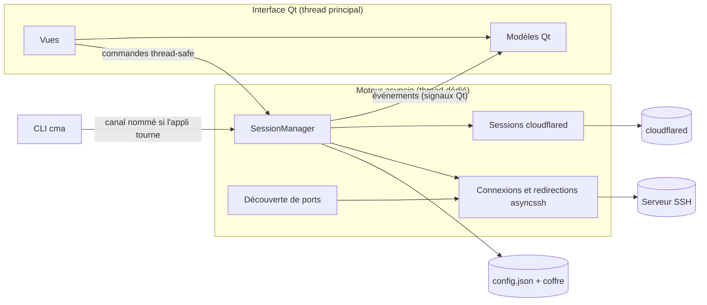
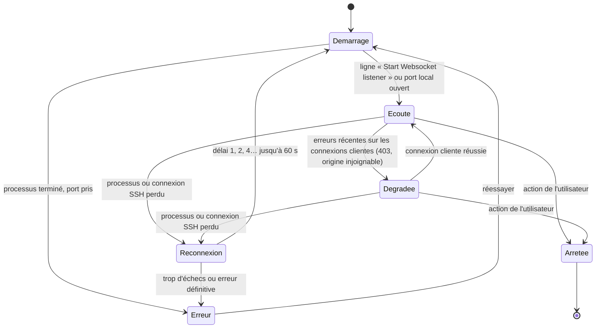

# Plan d'amélioration de Cloudflared Manage Access

Rédigé le 28/09/2026 à partir de la v1.4.0 (commit `9eb4d38`).

Sauf mention contraire, « l. N » renvoie à `CloudflaredManageAccess.py` dans ce commit.
Chaque constat et chaque tâche porte un identifiant (SEC-01, P2-7…) à réutiliser dans les commits, les issues et le CHANGELOG.
Les tâches sont des cases à cocher : le document sert aussi de suivi d'avancement (voir [État d'avancement](#état-davancement-au-29092026)).

## État d'avancement au 29/09/2026

Toutes les tâches des phases 0 à 6 et la checklist de parité (annexe C) sont réalisées dans l'arbre de travail, sans commit.
La v1.4.1 corrigée reste disponible à la racine, et la v2.0.0 vit dans `src/cma`.

| Indicateur | v1.4.0 | v2.0.0 mesurée | Cible |
|---|---|---|---|
| Délai avant fenêtre utilisable | 4,3 à 5,4 s (exe onefile) | ≈ 0,87 s depuis les sources, ≈ 0,75 s en exe à chaud (asyncssh chargé après l'affichage) | < 1,5 s |
| Surcoût par connexion cloudflared | ≈ 0,9 s de PowerShell + 1 s d'attente | aucun processus intermédiaire | aucun |
| Débit d'un tunnel SSH (banc local) | 6,2 Mio/s | 67,5 Mio/s | limité par le réseau |
| Distribution | exe onefile de 25,2 Mo | dossier de 85,4 Mo, zip portable de 39,6 Mo, installeur de 26,5 Mo | taille mesurée |
| RAM au repos de l'application | non mesurée | 140 Mo en mémoire de travail, 90 Mo privés | — |
| Tests automatisés | 0 | 253 tests Python, 20 tests bats par image (3 images) | — |
| Couverture | 0 % | 89 % au global, 90 % sur `core/` | 80 % et 90 % |
| Gel de l'interface | plusieurs secondes | aucune entrée-sortie dans le thread de l'interface, détecteur à 50 ms en mode debug | < 50 ms |

Ajouts faits après le plan, à la suite de la revue du 29/09/2026 : vue « Compte Cloudflare » (API : tunnels,
DNS, Access, service tokens), découverte des ports sur serveurs Windows, mise à jour automatique de la version
installée, audit d'accessibilité automatisé, proxy du profil pour `access login`, SBOM, manifestes winget, audit
des dépendances et tests contre le vrai cloudflared en CI.

Écarts assumés par rapport au plan :

- **Traductions.** Catalogue Python (`src/cma/i18n_en.py`) au lieu de fichiers Qt `.ts`. Un test vérifie que chaque texte affiché a sa traduction et qu'aucune n'est orpheline.
- **Tests bats.** Lancés dans des conteneurs Docker jetables (`tests/server/run-in-docker.sh`), en local comme en CI.
- **Purge de l'historique git.** Non faite : l'opération est destructive (force-push, nouveau clone partout) et se décide à part. Les artefacts sont seulement retirés de l'index.
- **Signature du code.** Optionnelle : la CI signe seulement si un certificat est fourni en secret.
- **Rendu haute densité.** Vérifié par captures à 125 %, 150 % et 200 % (`QT_SCALE_FACTOR`), pas sur plusieurs écrans physiques.
- **Dépendances de la v1.** `requirements-v1.txt` plutôt que `requirements.txt`, pour ne pas le confondre avec la v2.
- **Nuitka.** Non retenu : le mode onedir de PyInstaller démarre déjà en moins d'une seconde, et Nuitka changerait
  toute la chaîne de build pour un gain incertain. Les deux exécutables embarquent chacun leur archive Python (4,9 Mo).

---

## Sommaire

1. [Synthèse](#1-synthèse)
2. [Le projet tel qu'il est](#2-le-projet-tel-quil-est)
3. [Diagnostic](#3-diagnostic)
4. [Vision cible v2.0](#4-vision-cible-v20)
5. [Choix techniques](#5-choix-techniques)
6. [Architecture cible](#6-architecture-cible)
7. [Feuille de route](#7-feuille-de-route)
8. [Migration des données](#8-migration-des-données)
9. [Qualité, tests et CI](#9-qualité-tests-et-ci)
10. [Décisions à valider et risques](#10-décisions-à-valider-et-risques)
11. [Annexes](#11-annexes)

---

## 1. Synthèse

CMA est une application de bureau Tkinter, écrite dans un seul fichier de 1 876 lignes. Elle fait deux choses :

- lancer et arrêter des clients `cloudflared access tcp` vers des applications protégées par Cloudflare Access, avec service token et proxy optionnels ;
- ouvrir des redirections de ports SSH vers un serveur, après avoir listé ses ports en écoute grâce au script serveur `ports-report`.

L'outil sert au quotidien : ce poste contient 7 profils Cloudflare, 3 tokens et 2 profils SSH. L'audit relève quatre familles de problèmes.

- **Sécurité.** Les champs du formulaire sont injectés dans une commande PowerShell. Les secrets sont stockés en clair sur disque et passés en clair sur la ligne de commande. Les clés d'hôte SSH ne sont jamais vérifiées.
- **Fonctions cassées.** `ports-report` ne liste aucun port sur une Debian ou une Ubuntu standard. Le support Linux et macOS annoncé ne fonctionne pas. Un export contenant des accents se réimporte corrompu.
- **Interface.** Toutes les opérations réseau figent la fenêtre. L'état réel des connexions n'est pas suivi. Les retours passent par des popups modales.
- **Maintenabilité.** L'état global est partagé partout, le code est dupliqué ou mort, il n'y a aucun test. Le dépôt pèse 98 Mo à cause des exécutables commités.

**Recommandation.** Une v1.4.1 corrective d'une journée, puis une refonte v2.0 en six phases.

- La v2 sépare un cœur métier testable, sans interface, d'une interface Qt (PySide6).
- Elle remplace paramiko et ssh.exe par asyncssh.
- Elle range les secrets dans le Gestionnaire d'identifiants Windows.
- Elle est livrée par une CI qui produit un installeur et une version portable.
- Les données existantes migrent automatiquement, sans perte.

---

## 2. Le projet tel qu'il est

### 2.1 Inventaire du dépôt

| Élément | Rôle | Remarque |
|---|---|---|
| `CloudflaredManageAccess.py` | Toute l'application | 4 classes, une vingtaine de fonctions et variables globales |
| `SSH_redirect.py` | Prototype en ligne de commande de la redirection SSH | Importé nulle part : code mort |
| `ports-report` | Script Bash à installer sur le serveur | Liste les ports TCP, conteneurs Docker et statut HTTP |
| `script_ssh_redir.sh` | Installeur serveur : ports-report, helper Docker, règle sudoers | Embarque une **copie divergente** de ports-report |
| `ico/` | 6 PNG de 512×512 et l'icône `.ico` | Réduits à 15×15 à chaque démarrage |
| `CloudflaredManageAccess.spec` | Spec PyInstaller | Chemins absolus d'un autre poste (`C:\Users\a920634\...`) |
| `Compile.txt`, `README.md` | Commandes de build | Trois commandes différentes, aucune n'utilise le `.spec` |
| `build/`, `dist/`, `__pycache__/` | Artefacts de build | Versionnés. L'exe a été commité 17 fois |

Il n'existe ni `.gitignore`, ni `.gitattributes`, ni `pyproject.toml`, ni liste de dépendances, ni test, ni CI.
Seuls deux tags existent (`V.1.3.8`, `V1.3.9`) et la numérotation varie (`V1.3.8.4`, `V.1.3.9`).

### 2.2 Environnement constaté sur ce poste

| Élément | Valeur |
|---|---|
| Python | 3.14.6 |
| Dépendances | paramiko 5.0.0, Pillow 12.3.0, PyInstaller 6.21.0 |
| cloudflared | 2026.7.2 via winget. La dernière release est 2026.9.3 |
| Copie de cloudflared dans les données de l'application | 68 Mo, datée d'octobre 2025, oubliée |
| OpenSSH | `ssh.exe` et `ssh-keygen.exe` de Windows, utilisés pour les tunnels par clé |
| Signature de `cloudflared.exe` | Authenticode valide, « Cloudflare, Inc. » |

### 2.3 Structure du code

```text
Portée globale du module
├─ chemins           APPDATA_DIR, SSH_KEY_DIR, CONFIG_FILE, TOKENS_FILE, SSH_REDIR_FILE
├─ état mutable      PRESETS, TOKENS, SSH_REDIR, cloudflared_processes, tokens_choosing,
│                    active_ssh_tunnels, active_paramiko_connections, ssh_keys_summary
├─ images            chargées et redimensionnées à l'import (Pillow)
├─ utilitaires       timed_messagebox, update_connection_status (lit le global `app`),
│                    cleanup, cleanup_ssh_tunnels, parse_cloudflared_proc, terminate_process_tree
├─ SSHRedirector     fenêtre « Redirection SSH » (l. 219-849)
├─ CloudflaredTab    un onglet de connexion Cloudflare (l. 951-1538)
├─ CloudflaredGUI    fenêtre principale : barre cloudflared, onglets, statut (l. 1540-1822)
└─ Tooltip           infobulle de la liste des ports (l. 1824-1868)
```

### 2.4 Données persistées

Emplacement : `%APPDATA%\CloudflaredManager` sous Windows, `~/Library/Application Support/CloudflaredManager` sous macOS, `~/.config/CloudflaredManager` sous Linux.

| Fichier | Structure | Constat sur ce poste |
|---|---|---|
| `cloudflared_configs.json` | `{nom: {hostname, host, port, token_id, token_secret, proxy}}` | 7 profils, dont 5 avec un secret **recopié en clair** |
| `cloudflared_tokens.json` | `{nom: {token_id, token_secret}}` | 3 tokens en clair |
| `cloudflared_ssh_redir.json` | `{nom: {host, port, user}}` | 2 profils |
| `cloudflared_path.json` | `{path}` | Chemin de cloudflared |
| `ssh_keys/` | Clés ed25519 sans phrase de passe | Vide |
| `config.yml` | 3 octets | Référencé nulle part : vestige |

Les ports sont stockés en chaînes. Un profil contient une copie du secret, sans lien avec le token d'origine : modifier ou renommer le token ne met pas les profils à jour.

### 2.5 Flux principaux

**Connexion Cloudflare** (`CloudflaredTab.run_cloudflared`, l. 1456).

1. L'application vérifie le port local par un `bind`.
2. Elle construit une **chaîne PowerShell** : variables proxy, puis `& 'cloudflared' access tcp --hostname '…' --url '…'`. Si un token est utilisé, elle ajoute `--service-token-id X --service-token-secret Y` sans guillemets.
3. Elle lance `powershell.exe -NoProfile -Command <chaîne>` avec stdout et stderr redirigés vers des tubes.
4. Elle attend 1 s sur le thread de l'interface pour détecter « address already in use ».
5. Elle ajoute le processus à `cloudflared_processes` et le nom du token à `tokens_choosing`, deux listes parallèles indexées.

Pour fermer, l'application relit hostname, url et token par une regex appliquée à la ligne de commande, puis tue l'arbre de processus avec `taskkill /T /F`.

**Redirection SSH** (`SSHRedirector`).

- **Découverte.** Connexion paramiko, soit par mot de passe mis en cache en mémoire, soit avec la première clé `id_ed25519*` trouvée. L'application exécute `ports-report`, découpe la sortie texte par position et affiche « tcp (8080) - nom → HTTP ✅ ».
- **Tunnel par mot de passe.** Relais maison dans un thread paramiko : accept, select, `recv(1024)`.
- **Tunnel par clé.** Processus `ssh.exe -N -L local:localhost:distant`.
- **Suivi.** Les tunnels sont des tuples de 2 ou 3 éléments dans une même liste, distingués par leur longueur. Le libellé affiché est ré-analysé pour retrouver le protocole et le port à ouvrir.

**ports-report** (côté serveur).

1. `ss -tuln` est filtré par awk.
2. Pour chaque port TCP, le script cherche le service (`getent`), le conteneur Docker (via un helper sudo), puis sonde HTTPS et HTTP avec curl, 64 ports en parallèle.
3. La sortie a la forme `proto port [conteneur | service -] [HTTP code | HTTPS code | -]`.

---

## 3. Diagnostic

Sévérités : **Critique** pour une faille exploitable ou une fonction cassée, **Majeure** pour un comportement faux ou risqué, **Mineure** pour un défaut gênant.

### 3.1 Sécurité

| ID | Sév. | Constat | Où |
|---|---|---|---|
| SEC-01 | Critique | **Injection de commande.** Hostname, hôte, port, proxy, token id et secret sont concaténés dans une chaîne exécutée par PowerShell. Une apostrophe dans un champ, ou un profil importé piégé, exécute du code arbitraire. Le token id et le secret ne sont même pas entre guillemets. | l. 1496-1523 |
| SEC-02 | Critique | **Secret visible par tout le poste.** Le secret du service token passe en argument de ligne de commande, lisible par le Gestionnaire des tâches, WMI ou un EDR. cloudflared accepte pourtant `TUNNEL_SERVICE_TOKEN_ID` et `TUNNEL_SERVICE_TOKEN_SECRET` en variables d'environnement (vérifié sur 2026.7.2). | l. 1511 |
| SEC-03 | Critique | **Secrets en clair sur disque**, dupliqués dans les profils. L'export des tokens écrit lui aussi les secrets en clair. | l. 1218-1227, 1239-1244, 1314-1341 |
| SEC-04 | Majeure | **Aucune vérification de clé d'hôte.** `AutoAddPolicy` est utilisé partout. Une attaque de l'homme du milieu est triviale, et le mot de passe part alors chez l'attaquant. | l. 358, 378, 434, 493 |
| SEC-05 | Majeure | **Téléchargement non vérifié.** cloudflared est téléchargé sans contrôle de SHA-256 ni de signature. L'API GitHub publie pourtant un condensat par fichier (champ `digest`), et le binaire Windows est signé par Cloudflare. | l. 1732-1756 |
| SEC-06 | Majeure | **Envoi de clé publique peu fiable.** La clé est ajoutée par `echo "{pubkey}" >> authorized_keys`, en deux commandes lancées sur des canaux parallèles. Rien n'attend leur fin ni ne lit leur code retour, et la connexion est fermée aussitôt. Le succès s'affiche même en cas d'échec, et la clé est dupliquée à chaque envoi. | l. 438-441 |
| SEC-07 | Mineure | Les mots de passe SSH restent en mémoire toute la session, sans moyen de les oublier. Les clés sont générées sans phrase de passe. | l. 366, 423 |
| SEC-08 | Mineure | Dans ports-report, le test `[[ -n "$HELPER" ]]` est toujours vrai : le repli sur `docker ps` est du code mort. | ports-report l. 43 |

### 3.2 Bugs fonctionnels

| ID | Sév. | Constat | Où |
|---|---|---|---|
| BUG-01 | Critique | **ports-report muet sur Debian et Ubuntu.** Le script utilise `match(s, re, tableau)` à trois arguments, propre à gawk. Avec mawk, l'awk par défaut de ces distributions, la commande échoue et aucun port n'est listé. Vérifié dans l'image `debian:13-slim`. | ports-report l. 173 |
| BUG-02 | Critique | **Scripts en CRLF.** Avec `core.autocrlf=true` et sans `.gitattributes`, les scripts sont extraits en CRLF sous Windows. Copiés tels quels sur un serveur, ils échouent : `env: 'bash\r': No such file or directory` (vérifié). | dépôt |
| BUG-03 | Critique | **Linux et macOS non fonctionnels**, malgré le README. Les chemins d'icônes utilisent `\`, `iconbitmap` reçoit un `.ico`, et `powershell.exe` est codé en dur. | l. 106-121, 1523, 1871 |
| BUG-04 | Majeure | **Encodage.** Les JSON sont lus sans encodage explicite, donc en cp1252 sous Windows, mais exportés en UTF-8. Un export contenant des accents se réimporte corrompu, ou fait planter l'import. | l. 739, 811, 1256, 1275, 1765, 1768 |
| BUG-05 | Majeure | **Démarrage fragile.** Les écritures ne sont pas atomiques et la lecture au démarrage n'est pas protégée : un fichier tronqué empêche l'application de s'ouvrir. | l. 1764-1769 |
| BUG-06 | Majeure | **Listes parallèles désynchronisées.** Le nom du token est ajouté avant la validation des champs. Un processus en échec (« address already in use ») reste dans la liste. Les noms affichés à la fermeture deviennent faux. | l. 1506-1532 |
| BUG-07 | Majeure | **Aucun suivi de vie.** Un cloudflared qui s'arrête reste compté comme ouvert. Pour ssh.exe et pour un tunnel dont le `bind` a échoué, le succès s'affiche quand même. | l. 611-615, 643-682 |
| BUG-08 | Majeure | **Tunnel par clé fragile.** Si l'hôte est absent de `~/.ssh/known_hosts`, ssh.exe ne peut pas demander confirmation, faute de console, et s'arrête. Il n'y a ni `ExitOnForwardFailure` ni keepalive. | l. 603 |
| BUG-09 | Majeure | La clé utilisée est la première `id_ed25519*` du dossier, pas celle sélectionnée dans la liste. | l. 478, 593 |
| BUG-10 | Majeure | **Absence de ports-report non détectée.** `exec_command` ne lève pas d'exception quand la commande est introuvable. Le repli sur `ss` n'est donc jamais atteint, et sa sortie ne serait de toute façon pas analysable. | l. 499-505 |
| BUG-11 | Majeure | **Analyse positionnelle fragile.** Un port inconnu non HTTP s'affiche « HTTP Access Denied ». Le protocole est perdu pour les codes autres que 200 et 404, et « Ouvrir la page » échoue alors en silence. | l. 518-552, 579-581, 714-724 |
| BUG-12 | Majeure | **Profils SSH mélangés.** Supprimer un profil SSH recharge la liste avec les profils Cloudflare. Renommer et importer la rechargent avec les tokens. Les libellés parlent de « token ». | l. 772, 785, 798, 814 |
| BUG-13 | Majeure | **Mauvaise cible de tunnel.** Le tunnel vise toujours `localhost` côté serveur. Un service qui écoute sur une IP précise ou sur un bridge Docker est injoignable. ports-report supprime l'adresse d'écoute. | l. 604, 675 |
| BUG-14 | Mineure | **Exceptions non gérées dans les callbacks.** Un port vide fait `int('')`, une saisie annulée donne `None.get_transport()`. Dans l'exe fenêtré, l'échec est silencieux. | l. 452, 474, 572, 621-622 |
| BUG-15 | Mineure | `showwarning` et `showinfo` sont appelés avec un seul argument : le message prend la place du titre et le corps reste vide. | l. 504, 724 |
| BUG-16 | Mineure | Supprimer un onglet ne ferme pas ses connexions. Le compteur est décrémenté, si bien que deux onglets « Connexion 2 » peuvent coexister. | l. 1811-1822 |
| BUG-17 | Mineure | Les boutons d'export des profils et des tokens sont créés, mais jamais branchés ni affichés, alors que les méthodes existent. | l. 1021, 1033, 1285, 1314 |
| BUG-18 | Mineure | **Téléchargement incomplet.** Sous macOS, un `.tgz` est enregistré comme exécutable. L'architecture amd64 est imposée, sans ARM64. Le nom de fichier Windows est proposé sur tous les systèmes. | l. 1734-1746 |
| BUG-19 | Mineure | Le compteur de connexions ignore les tunnels SSH. | l. 202-205 |
| BUG-20 | Mineure | **Installeur serveur.** `script_ssh_redir.sh` se termine par une ligne `EOF` orpheline : il sort en erreur 127 après avoir affiché « Installation terminée ». Sa copie de ports-report diverge du fichier du dépôt, pour l'ordre HTTP/HTTPS et le suivi des redirections. | script_ssh_redir.sh l. 225, 113-132 |
| BUG-21 | Mineure | Les profils d'exemple n'apparaissent que si le fichier n'existe pas encore. À l'ouverture, le profil SSH « Default » est sélectionné mais ses valeurs ne sont pas chargées dans les champs. | l. 78-101, 240 |

### 3.3 Performance et réactivité

| ID | Constat | Où |
|---|---|---|
| PERF-01 | Toutes les opérations réseau tournent sur le thread de l'interface : connexion SSH, ports-report, téléchargement de 55 Mo. La fenêtre passe en « Ne répond pas ». | l. 472-565, 1751 |
| PERF-02 | Chaque lancement bloque l'interface 1 s (`communicate(timeout=1)`). Ensuite, sous Windows, les threads internes de `communicate` accumulent les journaux de cloudflared en mémoire, sans limite ni affichage. | l. 1528 |
| PERF-03 | Le relais SSH maison lit par blocs de 1 024 octets, avec un thread par connexion. Le débit est bridé et le coût CPU élevé pour une application web ou un transfert. | l. 627-637 |
| PERF-04 | Chaque connexion démarre un powershell.exe intermédiaire, mesuré entre 0,78 et 0,95 s ici, auquel s'ajoute l'attente de 1 s. | l. 1523 |
| PERF-05 | L'exe « onefile » de 25 Mo est extrait dans `%TEMP%` à chaque lancement. Le chargement du module seul prend environ 0,42 s à chaud. | spec, l. 1-21 |
| PERF-06 | Les icônes de 512×512 sont décodées puis réduites à 15×15 au démarrage : coût inutile et rendu flou. | l. 104-122 |

### 3.4 Interface et expérience utilisateur

| ID | Constat |
|---|---|
| UX-01 | Les fenêtres ont une taille fixe (700×440 et 420×660), ne sont pas redimensionnables et ignorent le DPI : flou et coupures à 125 % ou 150 %. |
| UX-02 | Thème ttk par défaut, sans mode sombre. Les icônes de 15 px sont floues. |
| UX-03 | Tout passe par des popups modales, y compris les succès. L'une d'elles reste au premier plan et capture le focus pendant 8 s. |
| UX-04 | Il n'y a aucune vue d'ensemble. L'état des connexions se découvre en cliquant sur le texte du statut, une fonction cachée. Les onglets n'affichent aucun indicateur. |
| UX-05 | Les barres d'outils de profil alignent six icônes sans infobulle ni libellé, dans un ordre différent selon la fenêtre. |
| UX-06 | Les champs ne sont pas validés en direct. Les erreurs de port ou de hostname apparaissent au clic. |
| UX-07 | Il n'y a pas d'icône dans la zone de notification. Fermer la fenêtre coupe toutes les connexions, sans confirmation. |
| UX-08 | Aucun journal n'est consultable : impossible de comprendre pourquoi une connexion échoue. |
| UX-09 | Les libellés sont incohérents : « token » pour un profil SSH, `port_label_ssh` dans l'onglet Cloudflare, mélange de français et d'anglais. |
| UX-10 | Le README annonce « 100 % portable », mais les données sont stockées dans `%APPDATA%`. |

### 3.5 Maintenabilité et outillage

| ID | Constat |
|---|---|
| MAINT-01 | Un fichier unique mêle interface, réseau, processus et persistance. L'état global mutable est partagé par toutes les classes. |
| MAINT-02 | **Code mort ou dupliqué.** `forward_tunnel` et `transfer` globaux ne sont jamais appelés (l. 126-153). `SSH_redirect.py` est inutilisé. Environ 110 lignes sont commentées (l. 1343-1396, 1605-1655). `refresh_key_list` est défini deux fois (l. 408, 727). La logique de fermeture est copiée deux fois (l. 1397-1454, 1656-1707). ports-report existe en deux versions. |
| MAINT-03 | Les données circulent en dictionnaires et chaînes, sans schéma ni validation. Les tuples sont distingués par leur longueur. Des informations sont reconstruites en ré-analysant des libellés d'affichage. |
| MAINT-04 | Il n'y a aucun journal : les `print` sont invisibles dans l'exe fenêtré. Les `except Exception` sont généralisés. |
| MAINT-05 | Il n'y a ni test, ni analyse statique, ni CI, et les dépendances ne sont ni déclarées ni figées. |
| MAINT-06 | Le build n'est pas reproductible : chemins d'un autre poste dans le `.spec`, UPX activé mais absent, trois commandes divergentes. L'exe n'est pas signé et n'a pas de métadonnées de version. |
| MAINT-07 | Les artefacts sont versionnés : le pack git pèse 98 Mo et grossit à chaque version. |
| MAINT-08 | L'application n'affiche pas son numéro de version. Il n'y a pas de CHANGELOG et les tags sont incomplets. |

### 3.6 Mesures de référence v1.4.0

Mesures prises sur ce poste le 28/09/2026. Elles serviront de point de comparaison en fin de projet.

| Mesure | Valeur |
|---|---|
| Taille de l'exe onefile | 25,2 Mo |
| Chargement du module Python, à chaud | ≈ 0,42 s |
| Démarrage de powershell.exe par connexion | 0,78 à 0,95 s |
| Attente bloquante après chaque lancement | 1 s |
| RAM de cloudflared au repos | 24 Mo |
| Pack git | 98 Mo |

---

## 4. Vision cible v2.0

### 4.1 Principes

1. **Sûr par défaut.** Aucun shell intermédiaire, secrets au coffre, clés d'hôte vérifiées, binaires vérifiés.
2. **Jamais bloquant.** L'interface ne fait aucune entrée-sortie elle-même.
3. **État réel.** Chaque session a un état observé (démarrage, à l'écoute, dégradée, erreur, arrêtée), jamais supposé.
4. **Cœur sans interface.** Le cœur métier est testable seul et réutilisable en ligne de commande.
5. **Données préservées.** Le format est versionné et la migration se fait sans perte.
6. **Rétrocompatible côté serveur.** Les serveurs déjà équipés de ports-report continuent de fonctionner.

### 4.2 Fonctionnalités cibles

**Tableau de bord unifié**

- Une liste unique regroupe toutes les sessions, Cloudflare et SSH. Chaque ligne montre l'état coloré, l'adresse locale copiable, la durée et les actions : ouvrir, journal, redémarrer, arrêter.
- Des actions rapides dépendent du type de service :
  - HTTP(S) ouvre le navigateur ;
  - SSH ouvre Windows Terminal sur `ssh -p <port> user@127.0.0.1` ;
  - RDP lance `mstsc /v:127.0.0.1:<port>` ;
  - MongoDB copie l'URI ou ouvre Compass ;
  - les autres copient `127.0.0.1:<port>`.

**Profils Cloudflare**

- Vue maître-détail : liste avec recherche, groupes, favoris et étiquettes de couleur à gauche, formulaire à droite.
- Le profil référence un token du coffre au lieu d'en copier le secret. Il peut aussi utiliser l'authentification navigateur d'Access (`cloudflared access login`), avec l'état du jeton affiché.
- Un bouton « Port auto » propose un port local libre.
- Options par profil : démarrage automatique, reconnexion automatique avec délai progressif, proxy, en-têtes supplémentaires (`--header`), type de service.
- Actions : dupliquer, importer ou exporter avec aperçu des conflits. L'export exclut les secrets par défaut.
- Un groupe entier se connecte ou se déconnecte en un clic.

**Coffre des tokens**

- Le secret est masqué, avec un bouton pour l'afficher et un pour le copier.
- La fiche indique les profils qui utilisent le token.
- Un test de validité lance brièvement cloudflared avec le token.

**Redirection SSH**

- Authentification par mot de passe, par clé (celle réellement sélectionnée, avec phrase de passe) ou par agent SSH (OpenSSH Windows, Pageant).
- Au premier contact, l'empreinte SHA-256 de l'hôte s'affiche et doit être confirmée. Les empreintes sont conservées dans un known_hosts propre à l'application, ou dans celui de l'utilisateur au choix.
- Les ports distants s'affichent dans un tableau triable et filtrable : port, adresse d'écoute, service, conteneur, statut HTTP, schéma.
- **Découverte sans installation.** L'application envoie ports-report par l'entrée standard (`bash -s`). Le script voyage avec l'application et a donc toujours la bonne version. L'installeur serveur ne sert plus qu'au helper Docker.
- Les redirections sont enregistrées dans le profil et se restaurent en un clic.
- **Chaînage.** Un profil SSH peut passer par un profil Cloudflare : l'application démarre cloudflared, puis ouvre le SSH sur son port local.
- Le déploiement de clé passe par SFTP, n'ajoute la clé que si elle manque, fixe les droits et vérifie le résultat.
- La génération de clé ed25519 est intégrée, sans dépendre de `ssh-keygen`.

**Gestion de cloudflared**

- Détection dans le PATH, dans winget et dans le dossier de l'application. La version est affichée et une alerte signale les mises à jour.
- Le téléchargement intégré affiche une progression. Il choisit la bonne architecture (amd64, arm64, 386), extrait le `.tgz` sous macOS et vérifie le SHA-256, plus la signature Authenticode sous Windows.
- Les journaux de cloudflared sont capturés et traduits en erreurs lisibles : token refusé, hostname inconnu, port pris, proxy injoignable.
- Le bloc `~/.ssh/config` peut être généré par `cloudflared access ssh-config`.

**Application**

- Une icône dans la zone de notification indique l'état global et offre un menu : favoris, ouvrir, quitter. La fenêtre se réduit dans la zone de notification. Quitter avec des sessions actives demande confirmation.
- Des notifications système remplacent les popups de succès. Les erreurs s'affichent en bandeau dans la fenêtre.
- Thème clair, sombre ou système, style Windows 11 natif. L'interface est redimensionnable et nette à toutes les échelles.
- Options : démarrage avec Windows, instance unique (un second lancement ramène la fenêtre existante).
- **Mode portable réel** : si un dossier `data/` existe à côté de l'exe, les données y sont stockées.
- Un journal applicatif rotatif est accessible par « Ouvrir le dossier des journaux ». Un rapport de diagnostic, sans secrets, s'exporte en zip.
- Interface en français, anglais en option.
- **Ligne de commande** : `cma list`, `cma connect <profil>`, `cma status`, `cma disconnect --all`. Si l'application tourne déjà, la commande lui est transmise.
- **Aucun processus orphelin** : les cloudflared lancés sont rattachés à un Job Object Windows et s'arrêtent avec l'application, même en cas de plantage.
- Un assistant de premier lancement détecte cloudflared, importe les données v1 et propose de créer un premier profil.

### 4.3 Hors périmètre

- La gestion côté serveur (création de tunnels, DNS, politiques Access via l'API Cloudflare) relève d'un autre produit. Elle pourra faire l'objet d'une v3.
- La découverte de ports sur des serveurs Windows pourra venir en v2.x si le besoin se présente.

### 4.4 Objectifs mesurables

| Indicateur | v1.4.0 | Cible v2.0 |
|---|---|---|
| Gel de l'interface | Plusieurs secondes par opération réseau | Aucun gel de plus de 50 ms |
| Surcoût par connexion cloudflared | ≈ 0,9 s de PowerShell et 1 s d'attente | Aucun processus intermédiaire. L'état « à l'écoute » arrive dès la ligne de journal |
| Débit d'un tunnel SSH | Relais par blocs de 1 Ko | Limité par le réseau, pas par l'application (mesure avant/après) |
| Mémoire des journaux | Non bornée | Tampon circulaire borné par session |
| Délai avant fenêtre utilisable | À mesurer en phase 0 | Moins de 1,5 s à froid |
| Couverture de tests | 0 % | Au moins 80 % au global, 90 % sur le cœur |

---

## 5. Choix techniques

| Sujet | Recommandation | Raison | Alternative écartée |
|---|---|---|---|
| Interface | **PySide6** (Qt 6, LGPL) | Style Windows 11 natif (Qt 6.7 et plus), mode sombre système, haute résolution native, vrais tableaux à modèle, zone de notification, notifications | Tkinter + sv-ttk + pystray coûte moins cher mais n'a pas de vrai tableau et gère mal le DPI. CustomTkinter, déjà installé, n'a ni tableau ni zone de notification. PyQt-Fluent-Widgets est sous GPL, incompatible avec une diffusion MIT |
| SSH | **asyncssh** | Redirection locale intégrée, known_hosts, génération de clés, agent, SFTP. Un seul code pour mot de passe et clé. Un serveur SSH de test peut tourner dans les tests | paramiko et ssh.exe, l'actuel, imposent deux chemins de code et un relais maison |
| Concurrence | Boucle asyncio dans un **thread moteur**. L'interface reçoit les événements par signaux Qt | Le cœur reste indépendant de Qt, et la CLI l'utilise via `asyncio.run` | qasync et QtAsyncio couplent le cœur à Qt |
| Processus | `asyncio.create_subprocess_exec` avec une liste d'arguments. Secrets et proxy passent par l'environnement, stderr est lu en flux, Job Object Windows | Plus de PowerShell ni d'injection, arrêt fiable | — |
| Modèles | **pydantic v2** | Validation des imports avec des messages clairs, sérialisation JSON, schéma versionné | dataclasses avec validation manuelle |
| Secrets | **keyring** : Gestionnaire d'identifiants Windows, Trousseau macOS, Secret Service Linux | Standard, aucun secret sur disque | Chiffrement maison |
| Journaux | `logging` standard, fichier rotatif, filtre qui masque les secrets | — | — |
| Projet | `pyproject.toml` et **uv** (winget `astral-sh.uv`), dépendances figées dans `uv.lock` | Environnement reproductible en une commande | requirements.txt manuel |
| Qualité | ruff (lint et format), pyright (strict sur le cœur), pytest, pytest-asyncio, pytest-qt, coverage. shellcheck et bats pour les scripts | — | — |
| Icônes | SVG Fluent UI System Icons ou Tabler Icons (MIT), recolorées selon le thème | Nettes à toutes les échelles, sans Pillow | PNG réduits à l'exécution |
| Distribution | PyInstaller en mode **onedir**, livré en installeur Inno Setup et en zip portable. Signature si un certificat est disponible | Démarrage sans extraction, moins de faux positifs antivirus qu'onefile avec UPX. Le mode onedir facilite aussi le respect de la LGPL de Qt | Nuitka, à évaluer en fin de projet sur le temps de démarrage |

Licences à reprendre dans `THIRD_PARTY_LICENSES.md` : PySide6 (LGPLv3), asyncssh (EPL-2.0), keyring (MIT), pydantic (MIT).

Version de Python : 3.13 ou plus. En phase 1, vérifier que PySide6 publie des roues pour Python 3.14. Sinon, figer 3.13 pour le build.

---

## 6. Architecture cible

### 6.1 Arborescence

```text
Cloudflared-Manage-Access/
├─ pyproject.toml, uv.lock
├─ src/cma/
│  ├─ __init__.py              __version__
│  ├─ __main__.py              python -m cma : interface par défaut, sous-commandes CLI
│  ├─ bootstrap.py             journaux, instance unique, chemins, migration, démarrage du moteur
│  ├─ core/                    aucune dépendance à Qt
│  │  ├─ models.py             CloudflareProfile, ServiceToken, SshProfile, SavedForward,
│  │  │                        Settings, Session, SessionState
│  │  ├─ config_store.py       lecture et écriture atomiques, schéma versionné, import/export
│  │  ├─ migrations.py         v1 (4 fichiers JSON) vers v2
│  │  ├─ secrets.py            coffre (keyring)
│  │  ├─ events.py             événements typés : SessionChanged, LogLine, Notification…
│  │  ├─ engine.py             boucle asyncio dans son thread, API thread-safe
│  │  ├─ netutil.py            ports libres, validation d'hôte et de port
│  │  ├─ cloudflared/
│  │  │  ├─ binary.py          détection, version, mise à jour, téléchargement vérifié
│  │  │  ├─ command.py         arguments et environnement, fonctions pures
│  │  │  ├─ session.py         cycle de vie, machine à états, reconnexion
│  │  │  └─ log_parser.py      lignes de journal vers événements et erreurs lisibles
│  │  └─ ssh/
│  │     ├─ connection.py      pool asyncssh, keepalive, known_hosts
│  │     ├─ forward.py         redirections locales
│  │     ├─ keys.py            génération, déploiement idempotent
│  │     └─ discovery.py       ports-report par stdin, analyse JSON
│  ├─ platform/                windows.py (Job Object, démarrage auto), posix.py,
│  │                           launchers.py (terminal, RDP, navigateur)
│  ├─ cli.py
│  ├─ ui/
│  │  ├─ app.py, main_window.py, tray.py, theme.py
│  │  ├─ views/                dashboard, profiles, tokens, ssh, logs, settings, onboarding
│  │  ├─ widgets/              status_pill, port_field, secret_field, toast
│  │  ├─ models/               QAbstractTableModel alimentés par les événements
│  │  └─ i18n/                 cma_fr.ts, cma_en.ts
│  └─ resources/               icônes SVG, copie embarquée de ports-report
├─ server/
│  ├─ ports-report             source unique du script
│  └─ install.sh               helper Docker optionnel, non interactif, désinstallable
├─ tests/                      unit/, integration/, ui/, server/ (bats)
├─ packaging/                  cma.spec, installer.iss, version_info.txt
├─ docs/                       ARCHITECTURE.md, SERVEUR.md, SECURITE.md, captures/
├─ .github/workflows/          ci.yml, release.yml
├─ .gitignore, .gitattributes, .pre-commit-config.yaml
└─ README.md, CHANGELOG.md, LICENSE.md, THIRD_PARTY_LICENSES.md
```

### 6.2 Règles d'architecture

- `core` n'importe ni Qt ni tkinter.
- `ui` ne fait aucune entrée-sortie. Il appelle l'API du moteur et réagit aux événements.
- Toute information métier vit dans un objet typé. L'interface ne ré-analyse jamais un libellé.
- Chaque session a un identifiant unique, ce qui supprime les listes parallèles.
- Toute écriture de fichier est atomique : fichier temporaire, puis `os.replace`.
- Aucun secret n'apparaît dans les journaux, les arguments de processus ou `config.json`.

### 6.3 Vue d'ensemble



### 6.4 Cycle de vie d'une session



L'état « à l'écoute » repose sur la ligne `INF Start Websocket listener host=127.0.0.1:<port>`, observée sur cloudflared 2026.7.2.
L'authentification Access n'a lieu qu'à la première connexion cliente : un token refusé se manifeste par un état « dégradé », pas par l'arrêt du processus.
Une sonde du port local sert de repli si le format du journal change.

### 6.5 Maquettes

Tableau de bord :

```text
 Cloudflared Manage Access                           3 actives · 1 alerte
─────────────────┬────────────────────────────────────────────────────────────
 Tableau de bord │ Sessions                     [Rechercher…]  [+ Connecter]
 Profils         │
 Tokens          │  ● mongo-prod   Cloudflare   127.0.0.1:27017  ⧉   2 h 14
 SSH             │    mongodb.exemple.fr        [Ouvrir] [Journal] [Arrêter]
 Journaux        │
                 │  ● grafana      SSH · nas    127.0.0.1:3000   ⧉   12 min
                 │    HTTPS 200                 [Ouvrir] [Journal] [Arrêter]
                 │
                 │  ▲ rdp-lab      Cloudflare   127.0.0.1:3389   ⧉   Dégradée
                 │    403 : token refusé        [Journal] [Redémarrer] [×]
                 │
                 │  Favoris   [▶ ssh-nas]  [■ mongo-prod]  [▶ rdp-lab]
 Paramètres      │
─────────────────┴────────────────────────────────────────────────────────────
 cloudflared 2026.7.2 · 2026.9.3 disponible                 Journal : 1 erreur
```

Vue SSH :

```text
 SSH › nas   admin@nas.exemple.lan:22 · clé id_ed25519_nas        ● Connecté
──────────────────────────────────────────────────────────────────────────────
 Ports distants                                    [Filtrer…]   [Actualiser]
  Port   Écoute       Service    Conteneur   Web
  22     0.0.0.0      ssh        -           -
  3000   127.0.0.1    -          grafana     HTTPS 302    [Rediriger → 3000]
  8080   172.17.0.1   http-alt   -           HTTP 200     [Rediriger → 8081]
──────────────────────────────────────────────────────────────────────────────
 Redirections enregistrées   3000 → 3000 (HTTPS) · 8080 → 8081 (HTTP)
                                                   [Tout ouvrir] [Tout fermer]
```

### 6.6 Règles de design

- Palette sémantique : vert pour « à l'écoute », ambre pour « démarrage », « dégradée » et « reconnexion », rouge pour « erreur », gris pour « arrêtée ». L'état est toujours doublé d'une icône et d'un texte, jamais porté par la seule couleur.
- Contrastes conformes WCAG AA dans les deux thèmes.
- Police système (Segoe UI Variable sous Windows 11). Espacements sur une grille de 4 px.
- Chaque bouton-icône a une infobulle et un nom accessible.
- Les écrans vides proposent une action : « Aucun profil, créer le premier ».
- Les erreurs de saisie s'affichent sous le champ, pas dans une popup.

---

## 7. Feuille de route

Dépendances : phase 0, puis phase 1, puis phases 2 et 3 en parallèle, puis phases 4, 5 et 6.
Versions : v1.4.1 après la phase 0, v2.0.0-alpha à la parité fonctionnelle (fin de phase 4), v2.0.0 après la phase 6.

| Phase | Contenu | Ordre de grandeur |
|---|---|---|
| 0 | Correctifs v1.4.1 | 1 jour |
| 1 | Fondations du dépôt | 1 à 2 jours |
| 2 | Cœur métier et données | 5 à 7 jours |
| 3 | SSH et découverte de ports | 4 à 6 jours |
| 4 | Nouvelle interface | 7 à 10 jours |
| 5 | Fonctionnalités avancées | 4 à 6 jours |
| 6 | Distribution et documentation | 2 à 3 jours |

Les durées sont des jours de travail concentré, à affiner après la phase 1.

### Phase 0 — v1.4.1 : correctifs immédiats sur le code actuel

Objectif : rendre la version actuelle sûre et fonctionnelle pendant la refonte.

- [x] **P0-1** Lancer cloudflared directement avec `Popen([chemin, "access", "tcp", ...])`. Passer proxy et token par `env=` (`HTTP_PROXY`, `HTTPS_PROXY`, `ALL_PROXY`, `TUNNEL_SERVICE_TOKEN_ID`, `TUNNEL_SERVICE_TOKEN_SECRET`). Utiliser `CREATE_NO_WINDOW` et envoyer la sortie dans un fichier journal plutôt que dans un tube. Corrige SEC-01, SEC-02, PERF-02 et PERF-04, et une partie de BUG-03.
- [x] **P0-2** Lire et écrire tous les JSON en UTF-8, avec écriture atomique. Si un fichier est illisible au démarrage, le sauvegarder en `.bak` et démarrer sur une configuration vide. Corrige BUG-04 et BUG-05.
- [x] **P0-3** Dans ports-report, remplacer le `match` à trois arguments par une extraction POSIX et tester `-x "$HELPER"`. Supprimer la ligne `EOF` finale de l'installeur et lui faire copier le fichier du dépôt. Ajouter un `.gitattributes` (`* text=auto`, `*.sh text eol=lf`, `ports-report text eol=lf`). Corrige BUG-01, BUG-02, BUG-20 et SEC-08.
- [x] **P0-4** Corriger les listes parallèles et les entrées fantômes (BUG-06), les listes de profils SSH (BUG-12), les popups à un argument (BUG-15). Brancher les exports (BUG-17). Ouvrir en `http://` par défaut quand le protocole est inconnu (BUG-11, en partie).
- [x] **P0-5** Ajouter un `.gitignore` (`build/`, `dist/`, `__pycache__/`, `*.pyc`) et retirer ces dossiers de l'index avec `git rm --cached`. L'exe est publié dans les Releases GitHub.
- [x] **P0-6** Créer un `requirements.txt` minimal, afficher la version dans le titre de la fenêtre, démarrer `CHANGELOG.md`. Mesurer le délai avant fenêtre utilisable de l'exe v1.4.0.

**Critères de fin**

- Une connexion avec un token dont le secret contient `'` et `$` se lance, s'arrête et se relance.
- Le secret n'apparaît pas dans la ligne de commande du processus (`Get-CimInstance Win32_Process`).
- ports-report liste les ports dans `debian:13-slim` et `ubuntu:24.04`, avec iproute2 et curl installés.
- Un profil accentué exporté puis réimporté reste identique.

### Phase 1 — Fondations du dépôt

- [x] **P1-1** Créer l'arborescence `src/cma`, `pyproject.toml`, l'environnement uv et les dépendances figées. L'application se lance par `python -m cma`.
- [x] **P1-2** Installer ruff, pyright et pre-commit. Conventions : identifiants en anglais, textes d'interface en français via l'i18n, docstrings en français.
- [x] **P1-3** Mettre en place la CI GitHub Actions : lint, typage, tests sur `windows-latest` et `ubuntu-latest`. Lancer shellcheck et bats dans des conteneurs Debian (mawk), Ubuntu et Alpine avec bash.
- [x] **P1-4** Journalisation : fichier rotatif dans le dossier de données, filtre de masquage des secrets. Capturer les exceptions non gérées (`sys.excepthook`, `threading.excepthook`, callbacks Qt) et afficher un message à l'utilisateur.
- [x] **P1-5** Adopter SemVer avec une version unique (`cma.__version__`), des tags `vX.Y.Z` et un CHANGELOG au format « Keep a Changelog ».
- [x] **P1-6** Vérifier les roues PySide6 pour Python 3.14 et choisir la version de Python du build.

**Critère de fin** : sur un squelette qui ouvre une fenêtre vide, `uv run pytest` et `uv run ruff check` passent en CI.

### Phase 2 — Cœur métier et données

- [x] **P2-1** Écrire les modèles pydantic (annexe B). Les objets ont un identifiant UUID : un nom n'est plus une clé.
- [x] **P2-2** ConfigStore : un seul `config.json` versionné, écriture atomique, verrou d'instance, sauvegardes automatiques des N dernières versions.
- [x] **P2-3** Coffre de secrets keyring. `config.json` ne contient aucun secret.
- [x] **P2-4** Migration v1 vers v2 (section 8), testée sur un jeu reproduisant la structure réelle.
- [x] **P2-5** Import et export : format v2, import v1 accepté, aperçu des conflits (ajouter, remplacer, renommer). L'export exclut les secrets par défaut. Un export avec secrets chiffré par phrase de passe est possible en option.
- [x] **P2-6** `cloudflared/command.py` : construction pure des arguments et de l'environnement. Tests exhaustifs : caractères spéciaux, proxy, en-têtes.
- [x] **P2-7** `cloudflared/session.py` : lancement par asyncio, Job Object Windows, lecture continue de stderr dans un tampon circulaire, machine à états, reconnexion avec délai exponentiel plafonné, arrêt propre (terminate, attente, kill).
- [x] **P2-8** `cloudflared/log_parser.py` : table de correspondances entre motifs de journal et messages clairs.
- [x] **P2-9** `cloudflared/binary.py` : détection, `--version`, dernière version par l'API GitHub avec cache de 24 h. Téléchargement en flux avec progression, vérification du `digest` SHA-256 et de la signature Authenticode, choix de l'architecture, extraction du `.tgz`.
- [x] **P2-10** Moteur (thread asyncio), bus d'événements et CLI minimale : `list`, `connect`, `status`, `disconnect`.

**Critères de fin**

- La CLI ouvre et ferme de vraies sessions cloudflared.
- La couverture dépasse 90 % sur `command.py`, `migrations.py` et `log_parser.py`.
- Un faux cloudflared, écrit en Python, permet de tester les états, un plantage et la reconnexion.

### Phase 3 — SSH et découverte de ports

- [x] **P3-1** `ssh/connection.py` : pool asyncssh par couple hôte, port et utilisateur. Keepalive. Authentification par mot de passe, clé ou agent. known_hosts de l'application avec confirmation d'empreinte. Mots de passe oubliés à la fermeture, sauf option « mémoriser dans le coffre ».
- [x] **P3-2** `ssh/forward.py` : `forward_local_port` sur 127.0.0.1. Le succès n'est annoncé qu'après un `bind` réussi. Fermeture propre et compteurs d'octets.
- [x] **P3-3** `ssh/keys.py` : génération ed25519 avec phrase de passe optionnelle. Déploiement idempotent par SFTP : lecture d'`authorized_keys`, ajout si la clé manque, droits 700 et 600. Import des clés existantes de `~/.ssh`.
- [x] **P3-4** ports-report v2 : option `--json` (NDJSON, annexe A), option `--version`, awk POSIX, exclusions paramétrables. La sortie texte v1 reste celle par défaut, pour les anciennes versions de l'application.
- [x] **P3-5** `ssh/discovery.py` : exécution par stdin (`bash -s -- --json`), sans installation. Repli sur `ss -tlnH` si bash est absent. La redirection vise l'adresse d'écoute réelle (BUG-13).
- [x] **P3-6** Chaînage d'un profil SSH à travers un profil Cloudflare.
- [x] **P3-7** `server/install.sh` : non interactif (`--user`), idempotent, avec `--uninstall`. La validation sudoers est conservée.

**Critères de fin**

- Des tests d'intégration tournent contre un serveur asyncssh lancé par le test : mot de passe, clé, empreinte inconnue, `bind` refusé.
- Les tests bats passent sur Debian (mawk), Ubuntu et Alpine avec bash.
- Le débit d'un tunnel est mesuré et comparé à la v1.4.0.

### Phase 4 — Nouvelle interface

- [x] **P4-1** Coquille : fenêtre redimensionnable avec barre latérale (tableau de bord, profils, tokens, SSH, journaux, paramètres). Style Windows 11, thème clair, sombre ou système, icônes SVG, taille et position mémorisées.
- [x] **P4-2** Tableau de bord (maquette 6.5).
- [x] **P4-3** Profils Cloudflare : maître-détail, recherche, groupes, favoris, validation en direct, port auto, choix du token, actions.
- [x] **P4-4** Coffre des tokens avec champ secret masqué.
- [x] **P4-5** SSH : profils, tableau des ports distants, redirections enregistrées, gestion des clés et des empreintes.
- [x] **P4-6** Journaux : flux en direct filtrable par session et par niveau, copie, export.
- [x] **P4-7** Paramètres : cloudflared (chemin, version, mise à jour), apparence, langue, démarrage, notifications, dossier de données, import et export global, à propos.
- [x] **P4-8** Zone de notification, notifications, instance unique, confirmation de sortie. Raccourcis : Ctrl+N, Ctrl+F, Ctrl+Entrée, Suppr, F5. Navigation au clavier et noms accessibles.
- [x] **P4-9** Assistant de premier lancement.
- [x] **P4-10** Traductions : français de référence, anglais.

**Critères de fin**

- Aucun appel bloquant sur le thread principal. Un détecteur de gel, actif en mode debug, alerte au-delà de 50 ms.
- Le rendu est vérifié à 100 %, 125 %, 150 % et 200 %.
- La checklist de parité (annexe C) est entièrement cochée.
- Les parcours principaux sont couverts par pytest-qt.

### Phase 5 — Fonctionnalités avancées

- [x] **P5-1** Actions rapides par type de service : terminal SSH, RDP, navigateur, URI MongoDB.
- [x] **P5-2** Authentification navigateur Access (`cloudflared access login`) et état du jeton (`cloudflared access token`).
- [x] **P5-3** Démarrage automatique de profils, démarrage avec Windows, groupes connectables en un clic.
- [x] **P5-4** CLI complète, avec transmission à l'instance en cours par canal nommé.
- [x] **P5-5** Mode portable (`data/` à côté de l'exe).
- [x] **P5-6** Rapport de diagnostic en zip : versions, système, journaux récents, configuration sans secrets.
- [x] **P5-7** Génération du bloc `~/.ssh/config` via `cloudflared access ssh-config`.
- [x] **P5-8** Vérification des mises à jour de CMA par les Releases GitHub.

**Critère de fin** : chaque fonctionnalité a ses tests et sa section dans la documentation.

### Phase 6 — Distribution et documentation

- [x] **P6-1** `packaging/cma.spec` en chemins relatifs et reproductible : mode onedir, modules Qt inutiles exclus, ressource de version Windows (FileVersion, ProductName), manifeste DPI.
- [x] **P6-2** Installeur Inno Setup (menu Démarrer, désinstallation, option de démarrage avec Windows) et zip portable. Fichier `SHA256SUMS` publié.
- [x] **P6-3** Workflow de release : sur un tag `vX.Y.Z`, build Windows et pièces jointes à la Release, avec les notes tirées du CHANGELOG. `gh` n'est pas installé sur ce poste : les releases passent par la CI ou par l'interface web.
- [x] **P6-4** Signature du code, optionnelle : elle demande un certificat (Azure Trusted Signing ou certificat OV). `signtool` est déjà présent sur ce poste.
- [x] **P6-5** Documentation : README refait (captures, installation, démarrage rapide, sécurité), `docs/SERVEUR.md`, `docs/ARCHITECTURE.md`, `docs/SECURITE.md`, `CONTRIBUTING.md`.
- [x] **P6-6** Mesures finales comparées à la section 3.6 : démarrage, taille, RAM au repos, débit d'un tunnel.

**Critère de fin** : un utilisateur installe l'application, retrouve ses profils et se connecte en ne lisant que le README.

---

## 8. Migration des données

Au premier lancement de la v2, si `config.json` est absent et que des fichiers v1 existent, la migration suit ces étapes.

1. Copier les quatre fichiers v1 dans `backup-v1-<date>/`.
2. Lire chaque fichier en UTF-8, puis en cp1252 en cas d'échec.
3. Transformer chaque token en `ServiceToken`. Son secret part dans le coffre.
4. Pour chaque profil Cloudflare :
   - si son `token_id` correspond à un token existant, le profil y fait référence ;
   - sinon, un token « <profil> (migré) » est créé ;
   - un proxy vide devient « aucun proxy » ;
   - le port est converti en entier. S'il est invalide, le profil est conservé en brouillon et signalé.
5. Transformer chaque profil SSH en `SshProfile`, avec l'authentification par mot de passe par défaut.
6. Reprendre le chemin de cloudflared dans les paramètres.
7. Écrire `config.json` v2.
8. Afficher un rapport : nombre de profils et de tokens migrés, avertissements.

Les fichiers v1 contiennent des secrets en clair. L'application propose de les supprimer, mais ne le fait jamais sans confirmation. Tant qu'ils existent, la v1.4 peut encore les lire, mais ils ne reçoivent plus les modifications faites dans la v2.

Le fichier `config.yml` n'est pas repris, et le rapport le signale.

Le jeu de test reproduit la structure constatée sur ce poste : 7 profils dont 5 avec un secret recopié, 3 tokens, 2 profils SSH, des accents dans les noms.

`config.json` porte un champ `schema_version`. Chaque évolution future ajoute une migration numérotée et testée.

---

## 9. Qualité, tests et CI

### 9.1 Niveaux de tests

| Niveau | Contenu |
|---|---|
| Unitaires | Construction de commande, analyse des journaux cloudflared, analyse de ports-report (texte v1 et JSON v2), migrations, validation des modèles, ports libres, masquage des secrets |
| Intégration | Faux cloudflared en Python : écoute, erreurs, plantage. Serveur SSH asyncssh en mémoire : authentification, empreintes, redirections, SFTP. Vrai cloudflared en option, marqué `real_cloudflared`, hors CI |
| Interface | pytest-qt sur les parcours : créer un profil, se connecter, voir l'état, arrêter. Test de gel |
| Scripts serveur | shellcheck. bats dans `debian:13-slim` (mawk), `ubuntu:24.04` et Alpine avec bash, avec des services factices (`python -m http.server`, `nc -l`) |
| Parité | Checklist manuelle v1 vers v2 (annexe C) avant la bascule |

### 9.2 Seuils

- Couverture d'au moins 80 % au global et 90 % sur `core/`.
- ruff sans erreur, pyright strict sur `core/`.
- Aucune régression sur la checklist de parité.

### 9.3 Intégration continue

- `ci.yml`, à chaque push et pull request : lint, typage, tests Windows et Ubuntu, scripts serveur.
- `release.yml`, à chaque tag : build, sommes de contrôle, Release GitHub.
- Dependabot pour suivre les dépendances Python et les actions GitHub.

---

## 10. Décisions à valider et risques

### 10.1 Décisions à trancher avant la phase 1

1. **Framework d'interface.** PySide6 est recommandé. Rester sur Tkinter ne change que la phase 4 (sv-ttk et pystray), pour un résultat visuel moins abouti.
2. **Purge de l'historique git.** Retirer les exe de l'historique libérerait environ 98 Mo. L'opération est destructive : elle impose un force-push et un nouveau clone partout. Elle est optionnelle et se décide à part.
3. **Linux et macOS.** Recommandation : garder un cœur multiplateforme testé en CI Ubuntu, et livrer Windows en priorité. L'autre option est de retirer ces systèmes de la documentation.
4. **Signature du code.** Elle suppose l'achat ou l'abonnement à un certificat.
5. **Anglais.** Utile si le dépôt public vise d'autres utilisateurs.

### 10.2 Risques

| Risque | Impact | Parade |
|---|---|---|
| Migration qui perd ou expose des secrets | Élevé | Sauvegarde préalable, tests sur la structure réelle, suppression des fichiers v1 seulement sur confirmation |
| Format des journaux cloudflared qui change | Moyen | Sonde du port local en repli, analyseur tolérant, tests sur plusieurs versions |
| Faux positifs antivirus | Moyen | Mode onedir sans UPX, signature, soumission à Microsoft si besoin |
| Refonte longue pendant laquelle la v1 reste figée | Moyen | Phase 0 d'abord, parité avant la bascule, versions alpha |
| Taille de l'exe avec Qt | Faible | Mode onedir, modules exclus, taille mesurée en CI |
| keyring indisponible (Linux sans Secret Service) | Faible | Message clair et stockage chiffré par phrase de passe en option |
| Pas de roues PySide6 pour Python 3.14 | Faible | Vérifié en P1-6, repli sur 3.13 |

---

## 11. Annexes

### A. Format ports-report v2

Une ligne JSON par port (NDJSON), obtenue avec `ports-report --json` :

```json
{"v":2,"proto":"tcp","port":3000,"bind":["127.0.0.1"],"service":null,"container":"grafana","scheme":"https","http_code":302,"final_url":"https://127.0.0.1:3000/login"}
{"v":2,"proto":"tcp","port":22,"bind":["0.0.0.0","::"],"service":"ssh","container":null,"scheme":null,"http_code":null,"final_url":null}
```

Sans option, la sortie texte v1 reste inchangée. `ports-report --version` affiche la version du script.

### B. Exemple de `config.json` v2

```json
{
  "schema_version": 2,
  "settings": {
    "cloudflared_path": "C:/Users/<utilisateur>/AppData/Local/Microsoft/WinGet/Links/cloudflared.exe",
    "theme": "system",
    "language": "fr",
    "minimize_to_tray": true,
    "start_with_windows": false,
    "local_port_range": [20000, 29999]
  },
  "tokens": [
    {"id": "7f3c…", "name": "Prod", "client_id": "xxxx.access", "created": "2026-10-01"}
  ],
  "cloudflare_profiles": [
    {
      "id": "a1b2…", "name": "MongoDB prod", "group": "Prod", "favorite": true,
      "hostname": "mongodb.exemple.fr", "local_host": "127.0.0.1", "local_port": 27017,
      "auth": {"type": "service_token", "token_id": "7f3c…"},
      "proxy": null, "headers": [], "service_type": "mongodb",
      "auto_start": false, "auto_reconnect": true
    }
  ],
  "ssh_profiles": [
    {
      "id": "c3d4…", "name": "NAS", "host": "nas.exemple.lan", "port": 22, "user": "admin",
      "auth": {"type": "key", "key_path": "ssh_keys/id_ed25519_nas"},
      "via_cloudflare_profile": null,
      "saved_forwards": [
        {"remote_host": "127.0.0.1", "remote_port": 3000, "local_port": 3000, "scheme": "https"}
      ]
    }
  ]
}
```

Le secret du token « Prod » est stocké dans le coffre sous la clé `cma/token/7f3c…`, jamais dans ce fichier.

### C. Checklist de parité v1 vers v2

- [x] Détection de cloudflared dans le PATH, sélection manuelle, téléchargement, lien vers la page Cloudflare
- [x] Plusieurs connexions simultanées (les onglets deviennent des sessions)
- [x] Profils Cloudflare : créer, enregistrer, renommer, supprimer, importer, exporter
- [x] Tokens : créer, enregistrer, renommer, supprimer, importer, exporter
- [x] Service token et proxy par connexion
- [x] Fermeture d'une connexion parmi plusieurs
- [x] Profils SSH : créer, enregistrer, renommer, supprimer, importer, exporter
- [x] Liste des ports distants avec service, conteneur et statut HTTP/HTTPS
- [x] Tunnel SSH par mot de passe et par clé
- [x] Ouvrir la page d'un tunnel HTTP ou HTTPS dans le navigateur
- [x] Fermer un tunnel SSH
- [x] Générer, supprimer et envoyer une clé SSH
- [x] Confirmation des sauvegardes (par notification)

### D. Correspondance entre le code actuel et les modules cibles

| Code actuel | Module cible |
|---|---|
| `run_cloudflared`, `parse_cloudflared_proc`, `terminate_process_tree`, `cloudflared_processes`, `tokens_choosing` | `core/cloudflared/command.py`, `session.py` |
| `detect_cloudflared`, `browse_exe`, `download_cloudflared`, `save_/load_saved_cloudflared_path` | `core/cloudflared/binary.py`, `ui/views/settings` |
| `PRESETS`, `TOKENS`, `SSH_REDIR` et leurs fonctions de chargement, sauvegarde, import, export, renommage, suppression | `core/config_store.py`, `secrets.py`, `migrations.py` |
| `SSHRedirector.init_connection`, `active_paramiko_connections` | `core/ssh/connection.py` |
| `create_ssh_tunnel`, `handler`, `forward_tunnel` imbriqué, `active_ssh_tunnels` | `core/ssh/forward.py` |
| `generate_ssh_key`, `send_ssh_key_to_server`, `delete_selected_key` | `core/ssh/keys.py` |
| `list_ports` et `ports-report` | `core/ssh/discovery.py`, `server/ports-report` |
| `timed_messagebox`, `Tooltip` | `ui/widgets/toast`, infobulles Qt natives |
| `SSH_redirect.py`, `forward_tunnel` et `transfer` globaux, blocs commentés | Supprimés |
